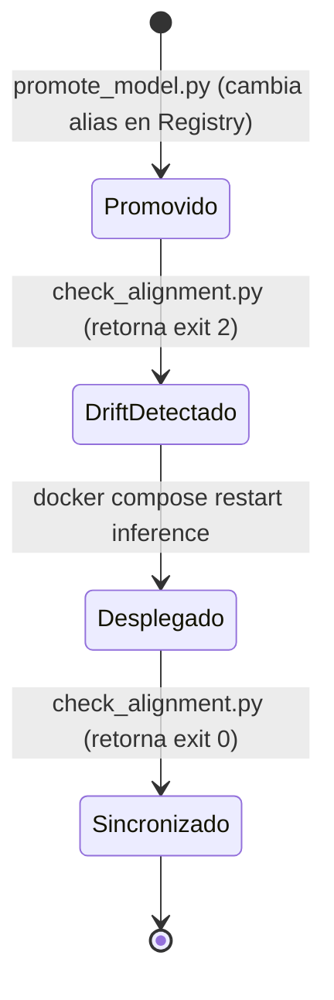

# Guía Operacional de Despliegue — SalaryPredict v1.0

Manual de referencia operacional y reproducible para desplegar, operar y reconstruir la plataforma **SalaryPredict v1.0**.

La arquitectura preserva la inmutabilidad de producción: los experimentos generan versiones versionadas en MLflow Model Registry bajo el nombre canónico **`salary_predict_model`**, y el alias operacional **`champion`** gobierna qué versión atiende las peticiones de inferencia.

---

## 1. Requisitos del Sistema

### Para levantar y usar la aplicación (Ruta estándar Docker)
- **Git**
- **Docker Engine** (v24.0+)
- **Docker Compose v2** (`docker compose`)

*Nota*: No se requiere Node.js ni herramientas de compilación en el host cuando se ejecuta mediante Docker Compose.

### Para reentrenar o ejecutar bootstrap desde cero
Además de Docker y Git:
- **Python 3.11** (recomendado; o 3.12)
- Entorno virtual (`python -m venv .venv`)
- Dependencias de `ml/` (`pip install -r ml/requirements.lock.txt`; consulte [`ml/README.md`](ml/README.md))
- **DVC** con acceso a un remoto DVC configurado (las dependencias y credenciales requeridas dependen del backend de almacenamiento elegido) o posesión local de los archivos CSV.

---

## 2. Configuración de Variables de Entorno

Copie la plantilla de variables de entorno en la raíz del repositorio:

```bash
cp .env.example .env
```

Por defecto, los valores predefinidos en `docker-compose.yml` operan de forma autónoma en entornos locales. Si despliega en un servidor remoto o instancia EC2, actualice `CORS_ORIGINS` con la IP pública o dominio del servidor:

```dotenv
MODEL_NAME=salary_predict_model
MODEL_ALIAS=champion
CORS_ORIGINS=http://localhost:5173,http://localhost:80,http://localhost,http://<IP_O_DOMINIO>:5173
```

### 2.1. Selección del servidor MLflow: local o remoto

La ubicación de MLflow es una decisión independiente de las modalidades A/B:

- **Modalidad A/B** describe el **estado del Registry**: si ya existe un `champion` o si debe crearse desde cero.
- **MLflow local/remoto** describe **dónde vive Tracking + Model Registry + artifacts**.

Por tanto, ambas modalidades pueden operar contra un MLflow local o contra un servidor MLflow remoto compartido.

| Configuración | Tracking / Registry | ¿Se levanta `mlflow-tracking` local? |
| :--- | :--- | :--- |
| **MLflow local** | Servicio Docker Compose del propio checkout | **Sí** |
| **MLflow remoto** | Servidor externo accesible por HTTP/HTTPS | **No** |

`MLFLOW_TRACKING_URI` selecciona el servidor MLflow utilizado por cada cliente. No copia modelos entre servidores ni sincroniza Registries: todos los componentes que participan en el ciclo deben apuntar explícitamente al **mismo MLflow objetivo**.

Los componentes que necesitan conocer el MLflow objetivo son:

```text
ml_pipeline track / register-candidate
            │
model_provider scripts
            │
inference (resuelve champion al arrancar)
            │
            └──> MLFLOW_TRACKING_URI
                    │
                    ├── Tracking
                    ├── Model Registry
                    └── Artifact Store
```

El `backend` y el `frontend` no necesitan acceso directo a MLflow.

#### MLflow local

Para comandos ejecutados desde el host:

```dotenv
MLFLOW_TRACKING_URI=http://localhost:5000
```

Dentro de la red de Docker, el servicio de inferencia utiliza normalmente:

```text
http://mlflow-tracking:5000
```

En esta modalidad el servicio `mlflow-tracking` forma parte del despliegue local.

#### MLflow remoto

Ejemplo conceptual:

```dotenv
MLFLOW_TRACKING_URI=https://<MLFLOW_HOST>
```

o, si se expone mediante un puerto específico:

```dotenv
MLFLOW_TRACKING_URI=http://<MLFLOW_HOST>:5000
```

El servidor remoto debe proporcionar:

- MLflow Tracking API accesible desde la máquina de entrenamiento y desde el contenedor de inferencia.
- Model Registry con el modelo y aliases correspondientes.
- Acceso a los artifacts de las versiones registradas. La autenticación adicional depende de cómo esté configurado el servidor y su artifact store.
- Conectividad de red y, si corresponde, credenciales suministradas fuera de Git.

Para el módulo `ml/`, configure `ml/.env` contra el servidor objetivo:

```dotenv
MLFLOW_TRACKING_URI=https://<MLFLOW_HOST>
MLFLOW_EXPERIMENT_NAME=salary-prediction
MLFLOW_MODEL_NAME=salary_predict_model
ML_REQUIRE_CLEAN_GIT=false
```

Los scripts administrativos y el servicio `inference` deben usar ese mismo `MLFLOW_TRACKING_URI`.

> [!IMPORTANT]
> Cambiar únicamente `ml/.env` configura los comandos ejecutados desde `ml/`; no implica automáticamente que el contenedor `inference` cambie de servidor. Antes de utilizar MLflow remoto, ejecute `docker compose config` y confirme que `inference` recibe el `MLFLOW_TRACKING_URI` remoto. Si `docker-compose.yml` fija explícitamente `http://mlflow-tracking:5000`, la configuración actual sigue siendo local-only y requiere parametrizar esa variable o utilizar un override de Compose antes de considerar soportado el modo remoto.

Verificación mínima de un MLflow remoto:

```bash
curl -fsS https://<MLFLOW_HOST>/ >/dev/null && echo "MLflow remoto accesible"

export MLFLOW_TRACKING_URI=https://<MLFLOW_HOST>
python model_provider/scripts/model_info.py --model salary_predict_model
```

Si el servidor está protegido por autenticación, configure las credenciales según el mecanismo elegido sin almacenarlas en el repositorio.

---

## 3. Modalidad A — Despliegue con Registry / Champion Existente

Utilice esta modalidad cuando el **MLflow objetivo**, local o remoto, ya contenga el modelo `salary_predict_model` con el alias `champion` asignado. Puede tratarse de volúmenes Docker persistentes reutilizados o de un servidor MLflow compartido.

Antes de levantar la aplicación, determine explícitamente cuál será el MLflow objetivo:

- **Local**: el stack utilizará `mlflow-tracking`.
- **Remoto**: configure `MLFLOW_TRACKING_URI` hacia el servidor externo y verifique que `inference` reciba esa misma URI. No es necesario levantar un Tracking Server local.

### Paso 1: Clonar y validar configuración

```bash
git clone git@github.com:PDS-Microproyecto-Grupo-13/Microproyecto.git
cd Microproyecto

# Validar sintaxis y variables de Docker Compose
docker compose config
```

### Paso 2: Levantar los servicios requeridos

**Con MLflow local**:

```bash
docker compose up -d --build
```

**Con MLflow remoto**:

No levante un Tracking Server local. Una vez confirmado que `inference` utiliza el `MLFLOW_TRACKING_URI` remoto, levante únicamente los servicios de aplicación:

```bash
docker compose up -d --build inference backend frontend
```

> [!NOTE]
> Si la definición vigente de Compose fuerza `mlflow-tracking` mediante `depends_on` o fija su URI internamente, primero debe adaptarse/parametrizarse Compose para soportar realmente MLflow remoto. No deben coexistir accidentalmente dos Registries diferentes dentro del mismo despliegue.

### Paso 3: Esperar y comprobar healthchecks

```bash
docker compose ps
```

Con MLflow local, todos los servicios del stack deben estar activos:
- `mlops-tracking`: `(healthy)` en puerto `5000`
- `mlops-inference`: `(healthy)` en puertos `5001` (serving) y `5002` (status)
- `mlops-backend`: `(healthy)` en puerto `8000`
- `mlops-frontend`: `Up` en puerto `5173`

Con MLflow remoto, `mlops-tracking` no forma parte del stack local; verifique en su lugar la disponibilidad del servidor remoto y que `inference` haya cargado una versión válida de `champion`.

Comprobación rápida vía HTTP:
```bash
curl -s http://localhost:8000/api/v1/health
# Respuesta: {"status":"ok","service":"mlops-backend","version":"0.1.0"}

curl -s http://localhost:5002/status
# Respuesta: {"status":"ok","model_name":"salary_predict_model","loaded_version":"<VERSION>",...}
```

Abra `http://localhost:5173` en su navegador para interactuar con la aplicación.

---

## 4. Modalidad B — Bootstrap Completo desde una Máquina Limpia

Utilice este procedimiento cuando el **MLflow objetivo** todavía no contenga el modelo registrado y/o el alias `champion`. La máquina de aplicación puede estar limpia aunque el servidor MLflow sea remoto y ya exista como infraestructura.

> [!IMPORTANT]
> El servicio `inference` (`start.py`) resuelve el alias `champion` de forma estricta en el momento de arrancar. Si se intenta levantar antes de registrar y promover el modelo en el MLflow objetivo, abortará con `alias_lookup_failed`. Se debe seguir el orden estricto indicado a continuación.

### Paso 1: Preparar el MLflow objetivo

Elija una de las dos variantes.

#### Variante local

Levante exclusivamente el servidor de Tracking:

```bash
docker compose up -d --build mlflow-tracking
```

Compruebe que responda:

```bash
curl -sI http://localhost:5000/ | head -n 5
# Debe retornar: HTTP/1.1 200 OK
```

Para los comandos ejecutados desde el host:

```dotenv
MLFLOW_TRACKING_URI=http://localhost:5000
```

#### Variante remota

No levante `mlflow-tracking` local. Configure el endpoint remoto como objetivo:

```dotenv
MLFLOW_TRACKING_URI=https://<MLFLOW_HOST>
```

Compruebe conectividad y acceso al Registry:

```bash
curl -fsS https://<MLFLOW_HOST>/ >/dev/null && echo "MLflow remoto accesible"

export MLFLOW_TRACKING_URI=https://<MLFLOW_HOST>
python model_provider/scripts/model_info.py --model salary_predict_model
```

Un resultado sin versiones registradas es válido en esta modalidad B: los siguientes pasos crearán el Run, la versión candidata y posteriormente el alias `champion` en **ese mismo Registry remoto**.

### Paso 2: Preparar el entorno de Machine Learning

Desde la carpeta `ml/`:

```bash
cd ml
python3 -m venv .venv
source .venv/bin/activate
pip install --upgrade pip
pip install -r requirements.lock.txt
```

Configure las variables de tracking para el módulo ML copiando su plantilla:

```bash
cp .env.example .env
```

Verifique que `ml/.env` apunte al **MLflow objetivo elegido en el Paso 1**:

```dotenv
# MLflow local:
MLFLOW_TRACKING_URI=http://localhost:5000

# O, para MLflow remoto:
# MLFLOW_TRACKING_URI=https://<MLFLOW_HOST>

MLFLOW_EXPERIMENT_NAME=salary-prediction
MLFLOW_MODEL_NAME=salary_predict_model
ML_REQUIRE_CLEAN_GIT=false
```

No ejecute `track` contra un servidor y `register-candidate` contra otro: Run, Registry y artifacts deben pertenecer al mismo MLflow objetivo.

### Paso 3: Disponibilizar los datos de entrada

El proyecto requiere acceso a un remoto DVC configurado o disponer localmente de los snapshots requeridos.

#### Procedimiento estándar (DVC Pull)

Desde el directorio `ml/`, ejecute:

```bash
cd ml
dvc pull
```

> [!NOTE]
> `dvc pull` no asume un proveedor específico ni requiere obligatoriamente Google OAuth, credenciales en la nube o claves SSH. Los requisitos de autenticación dependen exclusivamente del remoto DVC configurado.

#### Alternativas de remoto DVC disponibles

El pipeline ML no depende conceptualmente de un proveedor concreto. Existen dos implementaciones documentadas:

- **Google Drive**:
  Remoto administrado con autenticación y flujo propio de Google Drive. Requiere configurar credenciales locales en `.dvc/config.local`.
  - Consulte la guía detallada en [`ml/docs/CONFIGURACION_DVC_GOOGLE_DRIVE.md`](ml/docs/CONFIGURACION_DVC_GOOGLE_DRIVE.md).

- **Servidor Nginx + SSH**:
  Implementación autogestionada con dos canales de acceso sobre el mismo almacenamiento:
  - **HTTP read-only** (`dvc-public`) para `dvc pull` sin credenciales.
  - **SSH autenticado** (`dvc-write`) mediante claves públicas para `dvc push`.
  - Consulte las guías de infraestructura y clientes en:
    - [`ml/docs/DVC_NGINX_SERVER.md`](ml/docs/DVC_NGINX_SERVER.md) (Despliegue del servidor DVC con Docker, Nginx y SSH).
    - [`ml/docs/DVC_NGINX_CONFIG.md`](ml/docs/DVC_NGINX_CONFIG.md) (Configuración y uso de clientes DVC).

#### Alternativa: Materialización manual de snapshots

Si no se dispone de conexión a un remoto DVC:
- Copie físicamente los archivos `jobs_*.csv` requeridos por el checkout directamente en `ml/data/raw/foorilla/`.
- Todos los snapshots deben estar materializados: si existe un puntero `.dvc` para un snapshot cuyo CSV físico no esté disponible en el disco local, el preflight de integridad de `collect` abortará inmediatamente para impedir procesar un dataset parcial.

### Paso 4: Ejecutar el pipeline reproducible

Desde el directorio `ml/` con el entorno virtual activo:

```bash
dvc repro
```

Este comando ejecuta de forma determinista las 6 etapas del ciclo:
1. `collect`: Consolida y deduplica snapshots crudos.
2. `validate`: Comprueba invariantes de esquema y consistencia.
3. `preprocess`: Particionamiento temporal ordenado 70/15/15 y cálculo de límites operacionales en train.
4. `qualify`: Evaluación frente a baseline (DummyRegressor), verificación de gap temporal y calibración de incertidumbre conjunta al percentil 80%.
5. `train`: Ajuste definitivo del ensamble dual LightGBM sobre `train + validation` (46,208 registros) y serialización de `model.joblib`.
6. `evaluate`: Evaluación ciega en `test` (8,155 registros) y generación de reportes diagnósticos y de sensibilidad.

### Paso 5: Registrar la corrida en MLflow Tracking

```bash
python -m ml_pipeline track
```

Registra los hiperparámetros, métricas consolidadas, los 10 reportes de auditoría y empaqueta el wrapper `SalaryPredictorModel` en formato PyFunc.

### Paso 6: Crear versión candidata en Model Registry

```bash
python -m ml_pipeline register-candidate
```

Valida la elegibilidad (`eligible: true`), registra la nueva versión en el Model Registry, asigna los tags `candidate="true"` y `eligible="true"`, y ejecuta una prueba obligatoria de paridad numérica frente al tracking model.

> **Nota de gobierno**: `register-candidate` crea la versión pero **no la promueve** a producción.

### Paso 7: Inspeccionar la versión generada

Desde la raíz del repositorio:

```bash
cd ..
python model_provider/scripts/model_info.py --model salary_predict_model
```

Identifique el número de versión registrado (por ejemplo: `Version 1`, `Version 2`, etc.).

### Paso 8: Promover la versión a `champion`

Asigne el alias operacional utilizando el script de promoción:

```bash
python model_provider/scripts/promote_model.py \
  --model salary_predict_model \
  --version <VERSION> \
  --alias champion
```

### Paso 9: Levantar el resto de la aplicación

Una vez que `salary_predict_model@champion` existe formalmente en el **MLflow objetivo**:

```bash
docker compose up -d --build inference backend frontend
```

- Con **MLflow local**, `inference` debe resolver `champion` contra `mlflow-tracking`.
- Con **MLflow remoto**, `inference` debe resolver `champion` contra el mismo `MLFLOW_TRACKING_URI` utilizado por `track`, `register-candidate` y los scripts de gobierno; no debe depender de un Registry local vacío.

### Paso 10: Verificar alineación operacional

```bash
python model_provider/scripts/check_alignment.py
```

Salida esperada (código de retorno 0):
```text
=================================================================
 MLflow Serving Operational Alignment Check
=================================================================
 Model Name:             salary_predict_model
 Target Alias:           champion
 Registry Version:       <VERSION>
 Runtime Loaded Version: <VERSION>
 Runtime Server Alive:   True
-----------------------------------------------------------------
 Alignment Status:       SYNCHRONIZED (serving latest champion)
=================================================================
```

---

## 5. Prueba de Predicción End-to-End (E2E)

Pruebe la API directamente consumiendo el microservicio backend mediante `curl`:

```bash
curl -s -X POST http://localhost:8000/api/v1/predictions \
  -H "Content-Type: application/json" \
  -d '{
    "title": "Data Scientist",
    "experience_level": "SE",
    "experience_years": 6,
    "country": "Colombia",
    "is_remote": true,
    "company": "Example Corp",
    "company_is_agency": false,
    "technologies": ["Python", "SQL", "AWS"]
  }'
```

### Estructura de la Respuesta

```text
{
  "prediction": {
    "minimum_usd": <MINIMUM_USD>,
    "maximum_usd": <MAXIMUM_USD>,
    "midpoint_usd": <MIDPOINT_USD>
  },
  "model": {
    "name": "salary_predict_model",
    "alias": "champion",
    "version": "<VERSION>"
  },
  "warnings": []
}
```

- `prediction`: Rango salarial anual proyectado en dólares y punto medio ($y_{mid} = (y_{min} + y_{max}) / 2$). Los valores numéricos concretos varían según las características del perfil ingresado y la calibración del modelo en ejecución.
- `model`: Identificador del modelo, alias objetivo y versión concreta cargada actualmente por el contenedor de inferencia (la versión depende de qué corrida esté designada actualmente como champion).
- `warnings`: Advertencias operativas si faltaron campos opcionales que requirieron imputación.

*Flujo de procesamiento técnico*: Los datos crudos del usuario se traducen al contrato de MLflow. Dentro del wrapper PyFunc, la función `prepare_features()` estructura las 24 variables canónicas que ingresan al pipeline de Scikit-Learn (imputación, `TargetEncoder` categórico y estimadores `LightGBM` acotados a límites operacionales).

---

## 6. Ciclo Operacional: Promoción, Drift y Rollback

El principio rector del despliegue es **`PROMOTE != DEPLOY`**:



El servidor de serving carga el modelo en memoria **una sola vez al arrancar** (`start.py`). No existe *hot reload* automático para prevenir interrupciones o cambios inesperados durante la atención de tráfico. Para más información sobre los scripts y la arquitectura de serving, consulte [`model_provider/README.md`](model_provider/README.md).

### 1. Promover una nueva versión validada
```bash
python model_provider/scripts/promote_model.py \
  --model salary_predict_model \
  --version <NUEVA_VERSION> \
  --alias champion
```

### 2. Comprobar drift operacional
```bash
python model_provider/scripts/check_alignment.py
```
- Código de salida `2` (`REDEPLOY REQUIRED`): El Registry apunta a la nueva versión, pero el contenedor de inferencia continúa sirviendo la versión anterior de forma segura.
- Código de salida `1` (`RUNTIME UNHEALTHY` o error de conexión).

### 3. Ejecutar redeploy explícito
Reinicie el contenedor de inferencia para que descargue y recargue la versión del nuevo alias:
```bash
docker compose restart inference
```
*(Toma entre 5 y 15 segundos mientras uvicorn y el modelo inicializan en memoria).*

### 4. Confirmar sincronización
```bash
python model_provider/scripts/check_alignment.py
```
- Código de salida `0` (`SYNCHRONIZED`): La versión servida coincide con la del alias `champion`.

### 5. Procedimiento de Rollback Inmediato
Si la nueva versión presenta anomalías operacionales, revierta el servicio a la versión previa:
```bash
# 1. Reasignar alias champion a la versión previa estable
python model_provider/scripts/promote_model.py \
  --model salary_predict_model \
  --version <VERSION_ANTERIOR> \
  --alias champion

# 2. Reiniciar el microservicio de serving
docker compose restart inference

# 3. Validar sincronización
python model_provider/scripts/check_alignment.py
```

---

## 7. Despliegue en Servidor Remoto / Instancia EC2

En despliegues sobre máquinas virtuales independientes (Ubuntu / Debian en AWS EC2, GCP Compute Engine, etc.), Docker Compose se mantiene como el mecanismo canónico.

### 1. Variables de red y CORS
Edite `.env` en el servidor:
```dotenv
CORS_ORIGINS=http://localhost:5173,http://localhost:80,http://localhost,http://<IP_PUBLICA>:5173
```

### 2. Reglas de Firewall y Security Groups
Configure las reglas de entrada en el cortafuegos o grupo de seguridad:

| Puerto | Protocolo | Exposición Recomendada | Propósito |
| :--- | :--- | :--- | :--- |
| **5173** | TCP | Pública (`0.0.0.0/0`) | Acceso de usuarios al tablero web |
| **8000** | TCP | Opcional / Restringida | Acceso a API REST y Swagger Docs |
| **5000** | TCP | Restringida (IPs del equipo) | Panel administrativo de MLflow UI |
| **5001** | TCP | **Cerrado al exterior** | Puerto interno de inferencia (MLflow serving) |
| **5002** | TCP | **Cerrado al exterior** | Puerto interno de estado runtime |

*Nota de acceso al tracking*: Si el panel de MLflow UI (`:5000`) será accedido mediante una IP pública o dominio, puede ser necesario incluir dicho host en `MLFLOW_ALLOWED_HOSTS`, según la configuración vigente del servidor de tracking en `docker-compose.yml`.

### 3. Persistencia de almacenamiento
Los volúmenes nombrados `mlops-mlflow-db-data` y `mlops-mlflow-artifact-data` se almacenan en el sistema de archivos del host (`/var/lib/docker/volumes/`). En instancias EC2, asegúrese de que el disco raíz o el volumen EBS no sea efímero para conservar el historial de runs y artefactos.

---

## 8. Resolución de Problemas Comunes (Troubleshooting)

| Síntoma | Causa Raíz | Solución |
| :--- | :--- | :--- |
| `Inference container exits with alias_lookup_failed` | El contenedor `inference` intentó iniciar pero no existe el modelo `salary_predict_model` o el alias `champion` en MLflow. | Ejecute el procedimiento de la **Modalidad B** (bootstrap): levante solo `mlflow-tracking`, registre el modelo, asígnele el alias `champion` con `promote_model.py` y luego inicie `inference`. |
| `Inference container reports unhealthy` | El worker uvicorn tardó más del tiempo límite en inicializar LightGBM. | Verifique logs con `docker compose logs inference`. En equipos con recursos limitados, incremente el `start_period` en `docker-compose.yml`. |
| `Backend returns HTTP 502 / ExternalServiceError` | El backend no logra comunicarse con `http://inference:5001`. | Confirme que el contenedor `inference` esté saludable con `docker compose ps` y responda en su red. |
| `Error: Port already allocated (5000, 8000, 5173)` | Otro proceso local o contenedor previo ocupa el puerto del host. | Identifique el proceso (`lsof -i :<PUERTO>` o `netstat -tuln`) y deténgalo, o ajuste el mapeo de puertos en `docker-compose.yml`. |
| `ImportError: libgomp.so.1 cannot open shared object file` | Ocurre al ejecutar LightGBM directamente en Linux host sin la librería OpenMP instalada. | Ejecute `sudo apt-get update && sudo apt-get install -y libgomp1` en la máquina anfitriona. |
| `champion` existe en MLflow remoto pero `inference` reporta `alias_lookup_failed` | El pipeline/scripts apuntan al MLflow remoto, pero el contenedor `inference` continúa usando `http://mlflow-tracking:5000` u otro Registry. | Compare `MLFLOW_TRACKING_URI` en host y contenedor (`docker compose config`). Todos los componentes deben apuntar al mismo MLflow objetivo. |