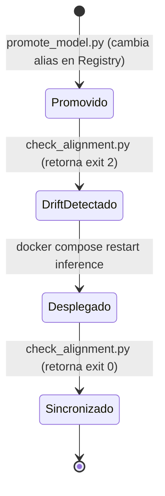

# Guía Operacional de Despliegue — SalaryPredict v1.0

Manual de referencia operacional y reproducible para desplegar, operar y reconstruir la plataforma **SalaryPredict v1.0**.

La arquitectura preserva la inmutabilidad de producción: los experimentos generan versiones versionadas en MLflow Model Registry bajo el nombre canónico **`salary-predictor`**, y el alias operacional **`champion`** gobierna qué versión atiende las peticiones de inferencia.

---

## 1. Requisitos del Sistema

### Para levantar y usar la aplicación (Ruta estándar Docker)
- **Git**
- **Docker Engine** (v24.0+)
- **Docker Compose v2** (`docker compose`)

*Nota*: No se requiere Node.js ni herramientas de compilación en el host cuando se ejecuta mediante Docker Compose.

### Para reentrenar o ejecutar bootstrap desde cero
Además de Docker y Git:
- **Python 3.11** (recomendado; o 3.12)
- Entorno virtual (`python -m venv .venv`)
- Dependencias de `ml/` (`pip install -r ml/requirements.lock.txt`)
- **DVC** con soporte remoto (`dvc-gdrive` o `dvc-s3`) y credenciales autorizadas, o posesión local de los archivos CSV.

---

## 2. Configuración de Variables de Entorno

Copie la plantilla de variables de entorno en la raíz del repositorio:

```bash
cp .env.example .env
```

Por defecto, los valores predefinidos en `docker-compose.yml` operan de forma autónoma en entornos locales. Si despliega en un servidor remoto o instancia EC2, actualice `CORS_ORIGINS` con la IP pública o dominio del servidor:

```dotenv
MODEL_NAME=salary-predictor
MODEL_ALIAS=champion
CORS_ORIGINS=http://localhost:5173,http://localhost:80,http://localhost,http://<IP_O_DOMINIO>:5173
```

---

## 3. Modalidad A — Despliegue con Registry / Champion Existente

Utilice esta modalidad cuando el servidor MLflow ya contenga el modelo `salary-predictor` con el alias `champion` asignado (por ejemplo, al reutilizar los volúmenes locales persistentes de Docker `mlops-mlflow-db-data` y `mlops-mlflow-artifact-data`, o al conectar con un MLflow corporativo).

### Paso 1: Clonar y validar configuración

```bash
git clone git@github.com:PDS-Microproyecto-Grupo-13/Microproyecto.git
cd Microproyecto

# Validar sintaxis y variables de Docker Compose
docker compose config
```

### Paso 2: Levantar el stack completo

```bash
docker compose up -d --build
```

### Paso 3: Esperar y comprobar healthchecks

```bash
docker compose ps
```

Todos los contenedores deben reportar estado saludable o activo:
- `mlops-tracking`: `(healthy)` en puerto `5000`
- `mlops-inference`: `(healthy)` en puertos `5001` (serving) y `5002` (status)
- `mlops-backend`: `(healthy)` en puerto `8000`
- `mlops-frontend`: `Up` en puerto `5173`

Comprobación rápida vía HTTP:
```bash
curl -s http://localhost:8000/api/v1/health
# Respuesta: {"status":"ok","service":"mlops-backend","version":"0.1.0"}

curl -s http://localhost:5002/status
# Respuesta: {"status":"ok","model_name":"salary-predictor","loaded_version":"<VERSION>",...}
```

Abra `http://localhost:5173` en su navegador para interactuar con la aplicación.

---

## 4. Modalidad B — Bootstrap Completo desde una Máquina Limpia

Utilice este procedimiento cuando despliegue en un **servidor o máquina totalmente limpia** donde la base de datos de MLflow esté vacía y no exista aún ningún modelo registrado ni alias `champion`.

> [!IMPORTANT]
> El servicio `inference` (`start.py`) resuelve el alias `champion` de forma estricta en el momento de arrancar. Si se intenta levantar antes de registrar y promover el modelo, abortará con `alias_lookup_failed`. Se debe seguir el orden estricto indicado a continuación.

### Paso 1: Levantar exclusivamente el servidor de Tracking

```bash
docker compose up -d --build mlflow-tracking
```

Compruebe que el servidor MLflow responda:
```bash
curl -sI http://localhost:5000/ | head -n 5
# Debe retornar: HTTP/1.1 200 OK
```

### Paso 2: Preparar el entorno de Machine Learning

Desde la carpeta `ml/`:

```bash
cd ml
python3 -m venv .venv
source .venv/bin/activate
pip install --upgrade pip
pip install -r requirements.lock.txt
```

Configure las variables de tracking para el módulo ML copiando su plantilla:

```bash
cp .env.example .env
```

Verifique que `ml/.env` contenga:
```dotenv
MLFLOW_TRACKING_URI=http://localhost:5000
MLFLOW_EXPERIMENT_NAME=salary-prediction
MLFLOW_MODEL_NAME=salary-predictor
ML_REQUIRE_CLEAN_GIT=false
```

### Paso 3: Disponibilizar los datos de entrada

El pipeline requiere los snapshots en `ml/data/raw/foorilla/jobs_*.csv`. Existen dos opciones:

- **Opción A (DVC Pull con acceso autorizado)**:
  Si dispone de credenciales para el remoto en Google Drive o AWS S3:
  ```bash
  dvc pull
  ```
- **Opción B (Transferencia manual)**:
  Copie físicamente los archivos `jobs_*.csv` requeridos por el checkout directamente en `ml/data/raw/foorilla/`. Todos los snapshots deben estar materializados: si existe un puntero `.dvc` para un snapshot cuyo CSV físico no esté disponible en el disco local, el preflight de integridad de `collect` abortará inmediatamente para impedir procesar un dataset parcial.

### Paso 4: Ejecutar el pipeline reproducible

Desde el directorio `ml/` con el entorno virtual activo:

```bash
dvc repro
```

Este comando ejecuta de forma determinista las 6 etapas del ciclo:
1. `collect`: Consolida y deduplica snapshots crudos.
2. `validate`: Comprueba invariantes de esquema y consistencia.
3. `preprocess`: Particionamiento temporal ordenado 70/15/15 y cálculo de límites operacionales en train.
4. `qualify`: Evaluación frente a baseline (DummyRegressor), verificación de gap temporal y calibración de incertidumbre conjunta al percentil 80%.
5. `train`: Ajuste definitivo del ensamble dual LightGBM sobre `train + validation` (46,208 registros) y serialización de `model.joblib`.
6. `evaluate`: Evaluación ciega en `test` (8,155 registros) y generación de reportes diagnósticos y de sensibilidad.

### Paso 5: Registrar la corrida en MLflow Tracking

```bash
python -m ml_pipeline track
```

Registra los hiperparámetros, métricas consolidadas, los 10 reportes de auditoría y empaqueta el wrapper `SalaryPredictorModel` en formato PyFunc.

### Paso 6: Crear versión candidata en Model Registry

```bash
python -m ml_pipeline register-candidate
```

Valida la elegibilidad (`eligible: true`), registra la nueva versión en el Model Registry, asigna los tags `candidate="true"` y `eligible="true"`, y ejecuta una prueba obligatoria de paridad numérica frente al tracking model.

> **Nota de gobierno**: `register-candidate` crea la versión pero **no la promueve** a producción.

### Paso 7: Inspeccionar la versión generada

Desde la raíz del repositorio:

```bash
cd ..
python model_provider/scripts/model_info.py --model salary-predictor
```

Identifique el número de versión registrado (por ejemplo: `Version 1`, `Version 2`, etc.).

### Paso 8: Promover la versión a `champion`

Asigne el alias operacional utilizando el script de promoción:

```bash
python model_provider/scripts/promote_model.py \
  --model salary-predictor \
  --version <VERSION> \
  --alias champion
```

### Paso 9: Levantar el resto de la aplicación

Una vez que `salary-predictor@champion` existe formalmente en el Registry:

```bash
docker compose up -d --build inference backend frontend
```

### Paso 10: Verificar alineación operacional

```bash
python model_provider/scripts/check_alignment.py
```

Salida esperada (código de retorno 0):
```text
=================================================================
 MLflow Serving Operational Alignment Check
=================================================================
 Model Name:             salary-predictor
 Target Alias:           champion
 Registry Version:       <VERSION>
 Runtime Loaded Version: <VERSION>
 Runtime Server Alive:   True
-----------------------------------------------------------------
 Alignment Status:       SYNCHRONIZED (serving latest champion)
=================================================================
```

---

## 5. Prueba de Predicción End-to-End (E2E)

Pruebe la API directamente consumiendo el microservicio backend mediante `curl`:

```bash
curl -s -X POST http://localhost:8000/api/v1/predictions \
  -H "Content-Type: application/json" \
  -d '{
    "title": "Data Scientist",
    "experience_level": "SE",
    "experience_years": 6,
    "country": "Colombia",
    "is_remote": true,
    "company": "Example Corp",
    "company_is_agency": false,
    "technologies": ["Python", "SQL", "AWS"]
  }'
```

### Estructura de la Respuesta

```text
{
  "prediction": {
    "minimum_usd": <MINIMUM_USD>,
    "maximum_usd": <MAXIMUM_USD>,
    "midpoint_usd": <MIDPOINT_USD>
  },
  "model": {
    "name": "salary-predictor",
    "alias": "champion",
    "version": "<VERSION>"
  },
  "warnings": []
}
```

- `prediction`: Rango salarial anual proyectado en dólares y punto medio ($y_{mid} = (y_{min} + y_{max}) / 2$). Los valores numéricos concretos varían según las características del perfil ingresado y la calibración del modelo en ejecución.
- `model`: Identificador del modelo, alias objetivo y versión concreta cargada actualmente por el contenedor de inferencia (la versión depende de qué corrida esté designada actualmente como champion).
- `warnings`: Advertencias operativas si faltaron campos opcionales que requirieron imputación.

*Flujo de procesamiento técnico*: Los datos crudos del usuario se traducen al contrato de MLflow. Dentro del wrapper PyFunc, la función `prepare_features()` estructura las 24 variables canónicas que ingresan al pipeline de Scikit-Learn (imputación, `TargetEncoder` categórico y estimadores `LightGBM` acotados a límites operacionales).

---

## 6. Ciclo Operacional: Promoción, Drift y Rollback

El principio rector del despliegue es **`PROMOTE != DEPLOY`**:



El servidor de serving carga el modelo en memoria **una sola vez al arrancar** (`start.py`). No existe *hot reload* automático para prevenir interrupciones o cambios inesperados durante la atención de tráfico.

### 1. Promover una nueva versión validada
```bash
python model_provider/scripts/promote_model.py \
  --model salary-predictor \
  --version <NUEVA_VERSION> \
  --alias champion
```

### 2. Comprobar drift operacional
```bash
python model_provider/scripts/check_alignment.py
```
- Código de salida `2` (`REDEPLOY REQUIRED`): El Registry apunta a la nueva versión, pero el contenedor de inferencia continúa sirviendo la versión anterior de forma segura.
- Código de salida `1` (`RUNTIME UNHEALTHY` o error de conexión).

### 3. Ejecutar redeploy explícito
Reinicie el contenedor de inferencia para que descargue y recargue la versión del nuevo alias:
```bash
docker compose restart inference
```
*(Toma entre 5 y 15 segundos mientras uvicorn y el modelo inicializan en memoria).*

### 4. Confirmar sincronización
```bash
python model_provider/scripts/check_alignment.py
```
- Código de salida `0` (`SYNCHRONIZED`): La versión servida coincide con la del alias `champion`.

### 5. Procedimiento de Rollback Inmediato
Si la nueva versión presenta anomalías operacionales, revierta el servicio a la versión previa:
```bash
# 1. Reasignar alias champion a la versión previa estable
python model_provider/scripts/promote_model.py \
  --model salary-predictor \
  --version <VERSION_ANTERIOR> \
  --alias champion

# 2. Reiniciar el microservicio de serving
docker compose restart inference

# 3. Validar sincronización
python model_provider/scripts/check_alignment.py
```

---

## 7. Despliegue en Servidor Remoto / Instancia EC2

En despliegues sobre máquinas virtuales independientes (Ubuntu / Debian en AWS EC2, GCP Compute Engine, etc.), Docker Compose se mantiene como el mecanismo canónico.

### 1. Variables de red y CORS
Edite `.env` en el servidor:
```dotenv
CORS_ORIGINS=http://localhost:5173,http://localhost:80,http://localhost,http://<IP_PUBLICA>:5173
```

### 2. Reglas de Firewall y Security Groups
Configure las reglas de entrada en el cortafuegos o grupo de seguridad:

| Puerto | Protocolo | Exposición Recomendada | Propósito |
| :--- | :--- | :--- | :--- |
| **5173** | TCP | Pública (`0.0.0.0/0`) | Acceso de usuarios al tablero web |
| **8000** | TCP | Opcional / Restringida | Acceso a API REST y Swagger Docs |
| **5000** | TCP | Restringida (IPs del equipo) | Panel administrativo de MLflow UI |
| **5001** | TCP | **Cerrado al exterior** | Puerto interno de inferencia (MLflow serving) |
| **5002** | TCP | **Cerrado al exterior** | Puerto interno de estado runtime |

*Nota de acceso al tracking*: Si el panel de MLflow UI (`:5000`) será accedido mediante una IP pública o dominio, puede ser necesario incluir dicho host en `MLFLOW_ALLOWED_HOSTS`, según la configuración vigente del servidor de tracking en `docker-compose.yml`.

### 3. Persistencia de almacenamiento
Los volúmenes nombrados `mlops-mlflow-db-data` y `mlops-mlflow-artifact-data` se almacenan en el sistema de archivos del host (`/var/lib/docker/volumes/`). En instancias EC2, asegúrese de que el disco raíz o el volumen EBS no sea efímero para conservar el historial de runs y artefactos.

---

## 8. Resolución de Problemas Comunes (Troubleshooting)

| Síntoma | Causa Raíz | Solución |
| :--- | :--- | :--- |
| `Inference container exits with alias_lookup_failed` | El contenedor `inference` intentó iniciar pero no existe el modelo `salary-predictor` o el alias `champion` en MLflow. | Ejecute el procedimiento de la **Modalidad B** (bootstrap): levante solo `mlflow-tracking`, registre el modelo, asígnele el alias `champion` con `promote_model.py` y luego inicie `inference`. |
| `Inference container reports unhealthy` | El worker uvicorn tardó más del tiempo límite en inicializar LightGBM. | Verifique logs con `docker compose logs inference`. En equipos con recursos limitados, incremente el `start_period` en `docker-compose.yml`. |
| `Backend returns HTTP 502 / ExternalServiceError` | El backend no logra comunicarse con `http://inference:5001`. | Confirme que el contenedor `inference` esté saludable con `docker compose ps` y responda en su red. |
| `Error: Port already allocated (5000, 8000, 5173)` | Otro proceso local o contenedor previo ocupa el puerto del host. | Identifique el proceso (`lsof -i :<PUERTO>` o `netstat -tuln`) y deténgalo, o ajuste el mapeo de puertos en `docker-compose.yml`. |
| `ImportError: libgomp.so.1 cannot open shared object file` | Ocurre al ejecutar LightGBM directamente en Linux host sin la librería OpenMP instalada. | Ejecute `sudo apt-get update && sudo apt-get install -y libgomp1` en la máquina anfitriona. |
