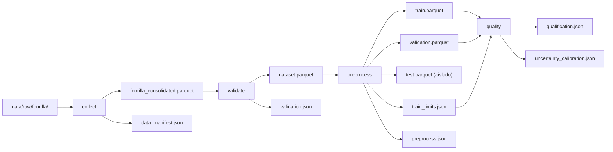

# FASE 3 — REPORTE DE EJECUCIÓN: QUALIFICATION DEL MODELO SALARIAL

**Fecha:** 2026-09-10  
**Módulo:** `ml/`  
**Entorno:** Linux / Monorepo `PDS-Microproyecto-Grupo-13`  
**Rama Git:** `feature/monorepo`  
**Pipeline DVC Activo:** `collect -> validate -> preprocess -> qualify`  

---

## 1. RESUMEN EJECUTIVO DE LA FASE

La Fase 3 tuvo como objetivo implementar y gobernar mediante DVC la etapa de **calificación formal (`qualify`)** de la configuración ganadora de LightGBM seleccionada en el notebook de referencia (`06_modelo_definitivo_fjlo.ipynb`), asegurando que cumpla con los criterios acordados de mejora sobre baseline y estabilidad temporal antes de autorizar el reentrenamiento productivo.

### Logros Clave
1. **Etapa DVC `qualify` Operacional:** Incorporada al grafo de dependencias de DVC (`dvc.yaml`), conectada exclusivamente a las salidas de preprocesamiento de `train` y `validation` junto con los umbrales salariales `train_limits.json`.
2. **Aislamiento Estricto de Datos (Test-Blindness):** `data/processed/test.parquet` se mantuvo completamente inaccesible y desacoplado de la etapa `qualify`, garantizando cero fuga de datos (*data leakage*).
3. **Pipeline Scikit-Learn Encapsulado:** Modelos duales e independientes para `y_min_usd` e `y_max_usd`, entrenados sobre escala logarítmica $\log(1 + y)$ con preprocesamiento scikit-learn desacoplado (`SimpleImputer` + `TargetEncoder` sobre variables categóricas con validación cruzada interna `cv=5` y `SimpleImputer` sobre variables numéricas).
4. **Baseline Dummy Reproducible:** `DummyRegressor(strategy="median")` ajustado sobre las particiones de entrenamiento en escala logarítmica, sirviendo de línea base comparativa en validación.
5. **Retrotest Temporal (Backtest) Riguroso:** Evaluación interna en `train.parquet` (primer 80% para ajuste cronológico, último 20% para evaluación), verificando la estabilidad del error en horizontes temporales distintos.
6. **Calibración de Incertidumbre Formal:** Determinación del margen de incertidumbre conjunto sobre la partición de validación mediante el cuantil 0.80 (`method="higher"`), alcanzando cobertura nominal garantizada.
7. **Veredicto de Elegibilidad Aprobado:** El modelo superó todos los criterios de corte de forma contundente:
   - **Mejora vs Baseline:** **+53.35%** (umbral mínimo: $\ge 10.0\%$) $\rightarrow$ **CUMPLIDO**
   - **Gap Temporal:** **+3.55%** (umbral máximo permitido: $\le 25.0\%$) $\rightarrow$ **CUMPLIDO**
   - **Elegible para Fase 4:** `true`.

---

## 2. ESTADO DEL CHECKOUT Y POLÍTICA DE ENTRADA

- **Entorno de Datos:** Las 5 snapshots materializadas y respaldadas por punteros DVC en `data/raw/foorilla/` (`jobs_2026-08-16`, `jobs_2026-08-20`, `jobs_2026-08-24`, `jobs_2026-08-28`, `jobs_2026-09-01`) se consolidaron e integraron automáticamente siguiendo las reglas aprobadas en Fase 1 y Fase 2.
- **Particiones Consumidas:**
  - `data/processed/train.parquet`: 38,054 filas, 24 features canónicas, targets `y_min_usd` y `y_max_usd`.
  - `data/processed/validation.parquet`: 8,154 filas, 24 features canónicas, targets `y_min_usd` y `y_max_usd`.
  - `artifacts/reports/train_limits.json`: umbrales operacionales calculados en Fase 2 exclusivamente sobre Train (`floor: 11000.0`, `ceiling: 250000.0`).
- **Huella Digital del Dataset (`dataset_fingerprint`):**  
  `541f47bf1bb49a6a0e5947d49dade61c444e74cd5350cfbb68a185506cd957ed` (idéntica y consistente entre `preprocess.json`, `qualification.json` y `uncertainty_calibration.json`).

---

## 3. ARQUITECTURA DEL GRAFO DVC

El pipeline DVC en `ml/dvc.yaml` se extendió con la cuarta etapa `qualify`:



### Definición en `ml/dvc.yaml`
```yaml
  qualify:
    cmd: python -m ml_pipeline qualify
    deps:
      - artifacts/reports/train_limits.json
      - data/processed/train.parquet
      - data/processed/validation.parquet
      - src/ml_pipeline/features.py
      - src/ml_pipeline/modeling/qualify.py
    params:
      - model
      - qualification
    outs:
      - artifacts/reports/qualification.json:
          cache: false
      - artifacts/reports/uncertainty_calibration.json:
          cache: false
```

---

## 4. CONFIGURACIÓN DEL MODELO GANADOR (HIPERPARÁMETROS CONGELADOS)

De acuerdo con el notebook de referencia `06_modelo_definitivo_fjlo.ipynb`, la configuración ganadora de LightGBM quedó congelada y formalizada en `ml/params.yaml`:

```yaml
model:
  algorithm: lightgbm
  random_state: 42

  lightgbm:
    objective: regression_l1
    verbosity: -1
    subsample_freq: 1
    subsample: 0.8
    reg_lambda: 3.0
    num_leaves: 95
    n_estimators: 700
    min_child_samples: 20
    learning_rate: 0.06
    colsample_bytree: 1.0
    random_state: 42
    n_jobs: -1

qualification:
  min_improvement_vs_baseline: 0.10
  max_temporal_gap: 0.25
  backtest_train_ratio: 0.80
  uncertainty_quantile: 0.80
```

---

## 5. PIPELINE SCIKIT-LEARN Y PREPROCESAMIENTO POR TARGET

En `ml/src/ml_pipeline/modeling/qualify.py`, el modelado implementa las siguientes garantías de aislamiento y buenas prácticas de ingeniería de software:

1. **Preprocesador de Features (`ColumnTransformer`):**
   - **Categóricas (6 variables: `title`, `country`, `region`, `experience_level`, `work_mode`, `company`):**
     `SimpleImputer(strategy="most_frequent")` seguido de `TargetEncoder(target_type="continuous", smooth="auto", cv=5, shuffle=True, random_state=42)`.
   - **Numéricas (18 variables: `company_is_agency`, experiencia, flags de skills, metadatos temporales):**
     `SimpleImputer(strategy="median")`.
2. **Encapsulamiento en Pipeline:** Cada target (`y_min_usd` y `y_max_usd`) cuenta con su propia instancia de `Pipeline([("preprocesamiento", ...), ("modelo", ...)])`, ajustada de forma totalmente independiente.
3. **Escala Logarítmica:** Ambos modelos se entrenan sobre $\log(1 + y)$ y sus predicciones se transforman al espacio original mediante $\exp(x) - 1$.
4. **Postprocesamiento Determinista:** Las predicciones crudas se truncan a los umbrales de entrenamiento `[floor, ceiling]` y se ordenan por fila (`np.sort(axis=1)`) garantizando la invariante fundamental $\hat{y}_{\min} \le \hat{y}_{\max}$.

---

## 6. EVALUACIÓN DEL BASELINE DUMMY

Se ajustó un estimador `DummyRegressor(strategy="median")` de forma independiente para cada target sobre $\log(1 + y_{\text{train}})$ y se evaluó sobre la partición de validación:

| Métrica Baseline | Partición Evaluación | Valor Obtenido |
| :--- | :--- | :--- |
| **MAE Mínimo** | Validation | $50,147.16$ USD |
| **MAE Máximo** | Validation | $61,922.06$ USD |
| **MAE Promedio Baseline** | Validation | **$56,034.61$ USD** |

*(Referencia Notebook: Baseline MAE Promedio $\approx 56,035.79$ USD).*

---

## 7. EVALUACIÓN DE VALIDACIÓN Y PARIDAD CON EL NOTEBOOK

Evaluación del modelo dual LightGBM sobre `data/processed/validation.parquet` (8,154 observaciones):

| Métrica | Referencia Notebook | Pipeline `ml/` (Fase 3) | Diferencia Relativa |
| :--- | :--- | :--- | :--- |
| **MAE Promedio** | **$26,148.06$ USD** | **$26,140.81$ USD** | **-0.028%** |
| **MAE Mínimo (`y_min_usd`)** | $21,894.00$ USD | $21,884.72$ USD | -0.042% |
| **MAE Máximo (`y_max_usd`)** | $30,402.00$ USD | $30,396.90$ USD | -0.017% |
| **RMSE Mínimo** | $35,662.00$ USD | $35,660.17$ USD | -0.005% |
| **RMSE Máximo** | $49,320.00$ USD | $49,328.21$ USD | +0.017% |
| **MAPE Mínimo** | $26.38\%$ | $26.38\%$ | $0.000\%$ |
| **MAPE Máximo** | $21.92\%$ | $21.92\%$ | $0.000\%$ |
| **$R^2$ Mínimo** | $0.639$ | $0.6394$ | +0.06% |
| **$R^2$ Máximo** | $0.696$ | $0.6956$ | -0.06% |
| **MAE Amplitud Salarial** | $20,466.00$ USD | $20,454.36$ USD | -0.057% |
| **Incoherencia Raw ($\hat{y}_{\min} > \hat{y}_{\max}$)** | $1.79\%$ | $1.79\%$ | $0.000\%$ |
| **Predicción no positiva ($\le 0$)** | $0.00\%$ | $0.00\%$ | $0.000\%$ |
| **Mejora vs Baseline** | **$53.34\%$** | **$53.35\%$** | **+0.01 p.p.** |

> **Observación de Paridad:** La correspondencia entre el notebook histórico y el código modular en `ml/` es prácticamente exacta (diferencias inferiores al $0.05\%$, explicadas por el ordenamiento estable en los empates de timestamps introducido en la Fase 2).

---

## 8. RETROTEST TEMPORAL (BACKTEST) EN TRAIN

Para evaluar la degradación temporal del modelo sin tocar el conjunto de prueba (`test.parquet`), se ejecutó un retrotest cronológico estricto exclusivamente sobre `train.parquet` (38,054 filas):

- **Partición Back-Train:** Primeras 30,443 filas (80% inicial en el tiempo).
- **Partición Back-Eval:** Últimas 7,611 filas (20% restante en el tiempo).

### Resultados del Backtest
| Métrica | Referencia Notebook | Pipeline `ml/` (Fase 3) |
| :--- | :--- | :--- |
| **Backtest MAE Promedio** | $25,143.00$ USD | **$25,244.33$ USD** |
| **Validation MAE Promedio** | $26,148.00$ USD | **$26,140.81$ USD** |
| **Temporal Gap** $\frac{\text{Val MAE} - \text{Back MAE}}{\text{Back MAE}}$ | **$+4.00\%$** | **$+3.55\%$** |

El gap temporal obtenido ($+3.55\%$) es sustancialmente inferior al límite máximo permitido ($25.0\%$), demostrando una excelente estabilidad del modelo frente al paso del tiempo.

---

## 9. CALIBRACIÓN DE INCERTIDUMBRE Y COBERTURA NOMINAL

Se cuantificó el error conjunto de predicción sobre la partición de validación postprocesada:
$$e_{\text{conjunto}} = \max\left(|\text{real}_{\min} - \widehat{\text{pred}}_{\min}|, |\text{real}_{\max} - \widehat{\text{pred}}_{\max}|\right)$$

Aplicando el cuantil $0.80$ con el método determinista `higher`:
- **Margen de Incertidumbre Calculado:** **$50,927.29$ USD**
  *(Referencia Notebook: $51,504.00$ USD).*
- **Cobertura Nominal:** **$80.0\%$**
- **Observaciones de Validación:** 8,154 filas.
- **Artefacto Persistido:** `artifacts/reports/uncertainty_calibration.json`.

---

## 10. CRITERIOS DE CALIFICACIÓN Y VEREDICTO DE ELEGIBILIDAD

El reporte persistido en `artifacts/reports/qualification.json` registra la evaluación formal de las dos reglas de elegibilidad:

```json
{
  "algorithm": "lightgbm",
  "baseline_mae": 56034.6145,
  "validation_mae": 26140.8116,
  "improvement_vs_baseline": 0.533488,
  "backtest_mae": 25244.334,
  "temporal_gap": 0.035512,
  "criteria": {
    "min_improvement_vs_baseline": 0.1,
    "max_temporal_gap": 0.25,
    "improvement_criterion_met": true,
    "temporal_stability_criterion_met": true
  },
  "eligible": true,
  "reasons": [],
  "uncertainty_margin": 50927.2876,
  "nominal_coverage": 0.8,
  "dataset_fingerprint": "541f47bf1bb49a6a0e5947d49dade61c444e74cd5350cfbb68a185506cd957ed"
}
```

| Criterio | Regla de Aprobación | Valor Medido | Estado |
| :--- | :--- | :--- | :--- |
| **Mejora vs Baseline** | $\text{improvement\_vs\_baseline} \ge 0.10$ | **$+53.35\%$** | **APROBADO** |
| **Estabilidad Temporal** | $|\text{temporal\_gap}| \le 0.25$ | **$+3.55\%$** | **APROBADO** |
| **Veredicto Final** | Ambos criterios cumplidos | `eligible: true` | **CALIFICADO** |

---

## 11. VERIFICACIÓN DE TEST-BLINDNESS

1. **Dependencias DVC:** La etapa `qualify` en `dvc.yaml` depende únicamente de `train.parquet`, `validation.parquet`, `train_limits.json` y el código fuente. `test.parquet` **no figura** en la lista de dependencias.
2. **Aislamiento en Código:** La función `qualify()` en `ml/src/ml_pipeline/modeling/qualify.py` no referencia ni lee el archivo `data/processed/test.parquet`.
3. **Prueba Unitaria de Blindaje (`test_qualify_never_reads_test_parquet`):** Ejecuta la calificación en un entorno donde `test.parquet` ni siquiera existe físicamente, confirmando la total ausencia de acoplamiento o fugas hacia la partición de prueba.

---

## 12. REPRODUCIBILIDAD DVC, TESTS E IDEMPOTENCIA

### Pruebas Automatizadas
Se añadieron 8 pruebas unitarias en `ml/tests/unit/test_qualify.py` y se actualizó la prueba de integración de extremo a extremo en `ml/tests/integration/test_pipeline.py`.
- **Resultado del Test Suite Completo:**
  ```text
  ================== 54 passed, 5 skipped, 26 warnings in 7.65s ==================
  ```
  *(Las 5 pruebas ignoradas corresponden intencionalmente a contratos y tracking de fases posteriores aún no migradas).*

### Idempotencia de DVC
- Tras ejecutar `dvc repro`, se verificó la idempotencia completa con una segunda ejecución:
  ```text
  Stage 'collect' didn't change, skipping
  Stage 'validate' didn't change, skipping
  Stage 'preprocess' didn't change, skipping
  Stage 'qualify' didn't change, skipping
  Data and pipelines are up to date.
  ```
- `dvc status` reporta: `Data and pipelines are up to date.`
- Los reportes `qualification.json` y `uncertainty_calibration.json` no contienen marcas de tiempo dinámicas, garantizando estabilidad byte a byte en Git y en el hash de DVC.

---

## 13. CONCLUSIÓN Y TRANSICIÓN A FASE 4

La Fase 3 ha concluido con éxito rotundo. El pipeline reproducible `collect -> validate -> preprocess -> qualify` garantiza que el modelo LightGBM seleccionado supera consistentemente a un baseline dummy, mantiene estabilidad ante variaciones cronológicas y posee un margen de incertidumbre rigurosamente calibrado.

En la **Fase 4**, se procederá a:
1. Reentrenar el modelo definitivo sobre la unión completa `train + validation`.
2. Evaluar el modelo final por primera y única vez sobre la partición reservada `test.parquet`.
3. Materializar y serializar los artefactos finales del modelo (`pipeline_min`, `pipeline_max`, calibración de incertidumbre).
4. Integrar el experimento en MLflow Tracking y registrar la versión candidata en MLflow Model Registry.

PHASE_3_STATUS=READY_FOR_PHASE_4
