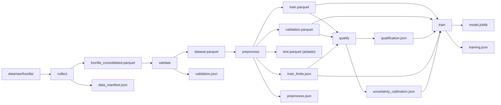

# FASE 4 — REPORTE DE EJECUCIÓN: ENTRENAMIENTO DEFINITIVO DEL MODELO SALARIAL

**Fecha:** 2026-09-10  
**Módulo:** `ml/`  
**Entorno:** Linux / Monorepo `PDS-Microproyecto-Grupo-13`  
**Rama Git:** `feature/monorepo`  
**Pipeline DVC Activo:** `collect -> validate -> preprocess -> qualify -> train`  

---

## 1. RESUMEN EJECUTIVO DE LA FASE

La Fase 4 tuvo como objetivo implementar y gobernar mediante DVC la etapa de **entrenamiento definitivo (`train`)** del modelo salarial, integrando la configuración ganadora de LightGBM validada en la Fase 3 y ajustándola sobre la unión completa de las particiones de entrenamiento y validación (`train.parquet + validation.parquet`).

### Logros Clave
1. **Etapa DVC `train` Operacional:** Incorporada al grafo de dependencias de DVC (`dvc.yaml`), dependiendo exclusivamente de `train.parquet`, `validation.parquet`, `qualification.json`, `train_limits.json`, `uncertainty_calibration.json` y el código fuente de modelado.
2. **Compuerta de Calificación Estricta (Gatekeeper):** La etapa `train` valida formalmente como precondición obligatoria que `qualification.json -> eligible == true`. En caso contrario, aborta la ejecución con un error descriptivo.
3. **Ajuste Definitivo sobre 46,208 Filas:** Se combinaron exactamente las 38,054 filas de `train` y las 8,154 filas de `validation`. Ambos pipelines (`pipeline_min` y `pipeline_max`) y sus respectivos `TargetEncoder` se ajustaron desde cero exclusivamente sobre esta unión en escala logarítmica $\log(1 + y)$.
4. **Preservación de Calibración de Incertidumbre y Límites:** Se consumieron sin recalcular:
   - Límites operativos: `floor = 10935.571999999996` y `ceiling = 720000.0` (calculados en Fase 2 sobre Train).
   - Margen de incertidumbre: `uncertainty_margin = 50927.2876` USD (calibrado en Fase 3 sobre Validation).
5. **Artefacto de Trabajo Persistido (`artifacts/work/model/model.joblib`):** Bundle autocontenido con compresión zlib (`compress=3`) que incluye `pipeline_min`, `pipeline_max`, límites salariales, margen de incertidumbre y el contrato canónico de 24 features.
6. **Funciones Locales de Inferencia:** Se implementaron `predict_range()` y `predict_with_uncertainty()` garantizando validación de contrato de columnas, transformación inversa $\exp(x)-1$, recorte estricto a límites `[floor, ceiling]` y la invariante $\hat{y}_{\min} \le \hat{y}_{\max}$.
7. **Reporte Determinista (`artifacts/reports/training.json`):** Manifiesto JSON con metadatos del entrenamiento, sin marcas de tiempo variables y libre de métricas de test.
8. **Test-Blindness Total:** `data/processed/test.parquet` se mantuvo completamente inaccesible y desacoplado, sin haber sido leído ni evaluado.

---

## 2. ACLARACIÓN DOCUMENTAL SOBRE LÍMITES DE ENTRENAMIENTO

Se deja constancia explícita de la rectificación del error documental presente en la sección 2 del reporte de Fase 3:
- Los valores canónicos y operativos generados en Fase 2 en [`artifacts/reports/train_limits.json`](file:///home/jorge/Descargas/mlops/micro-proyecto/Microproyecto/ml/artifacts/reports/train_limits.json) son:
  - `floor = 10935.571999999996` (cuantil 0.001 de `y_min_usd` en train con cota mínima de $1,000 USD).
  - `ceiling = 720000.0` (cuantil 0.999 de `y_max_usd` en train).
  - `source_split = "train"`
- Estos valores **no fueron recalculados** y se han propagado íntegramente al bundle [`artifacts/work/model/model.joblib`](file:///home/jorge/Descargas/mlops/micro-proyecto/Microproyecto/ml/artifacts/work/model/model.joblib) y al reporte [`artifacts/reports/training.json`](file:///home/jorge/Descargas/mlops/micro-proyecto/Microproyecto/ml/artifacts/reports/training.json).

---

## 3. ARQUITECTURA DEL GRAFO DVC

El pipeline DVC en [`ml/dvc.yaml`](file:///home/jorge/Descargas/mlops/micro-proyecto/Microproyecto/ml/dvc.yaml) comprende ahora 5 etapas reproducibles:



### Definición en `ml/dvc.yaml`
```yaml
  train:
    cmd: python -m ml_pipeline train
    deps:
      - artifacts/reports/qualification.json
      - artifacts/reports/train_limits.json
      - artifacts/reports/uncertainty_calibration.json
      - data/processed/train.parquet
      - data/processed/validation.parquet
      - src/ml_pipeline/features.py
      - src/ml_pipeline/modeling/qualify.py
      - src/ml_pipeline/modeling/train.py
    params:
      - model
    outs:
      - artifacts/reports/training.json:
          cache: false
      - artifacts/work/model/model.joblib
```

---

## 4. COMPUERTA DE CALIFICACIÓN (QUALIFICATION GATE)

El módulo `train` comprueba automáticamente antes de cualquier cómputo:
1. Existencia del archivo `artifacts/reports/qualification.json`.
2. Evaluación del campo `eligible == true`.

Si el modelo no fue calificado o fue rechazado en Fase 3, el pipeline detiene inmediatamente su ejecución (`RuntimeError`):
```text
Training gate failed: model configuration is not eligible for final training (qualification.json -> eligible == false).
```
En el checkout actual:
- `eligible`: `true`
- `improvement_vs_baseline`: `0.533488` ($+53.35\% \ge 10.0\%$)
- `temporal_gap`: `0.035512` ($+3.55\% \le 25.0\%$)
- **Resultado:** Compuerta superada exitosamente.

---

## 5. VOLUMETRÍA Y PARTICIONES DE ENTRENAMIENTO

| Partición | Registros | Propósito en Fase 4 |
| :--- | :--- | :--- |
| `data/processed/train.parquet` | 38,054 | Subconjunto temporal inicial (70%) |
| `data/processed/validation.parquet` | 8,154 | Subconjunto temporal intermedio (15%) |
| **Total Ajuste Definitivo (`train + validation`)** | **46,208** | **Universo de ajuste para los modelos finales** |
| `data/processed/test.parquet` | 8,155 | **ESTRICTAMENTE NO LEÍDO NI EVALUADO** (15%) |

- **Huella Digital del Dataset (`dataset_fingerprint`):**  
  `541f47bf1bb49a6a0e5947d49dade61c444e74cd5350cfbb68a185506cd957ed` (coherente con Fase 2 y Fase 3).

---

## 6. CONFIGURACIÓN EFECTIVA Y PIPELINE DE MODELADO

### Hiperparámetros Congelados de LightGBM
```yaml
model:
  algorithm: lightgbm
  random_state: 42
  lightgbm:
    objective: regression_l1
    verbosity: -1
    subsample_freq: 1
    subsample: 0.8
    reg_lambda: 3.0
    num_leaves: 95
    n_estimators: 700
    min_child_samples: 20
    learning_rate: 0.06
    colsample_bytree: 1.0
    random_state: 42
    n_jobs: -1
```

### Arquitectura de Preprocesamiento y Modelado
- **Variables Categóricas (6):** `title`, `country`, `region`, `experience_level`, `work_mode`, `company`.
  - Imputación: `SimpleImputer(strategy="most_frequent")`.
  - Codificación: `TargetEncoder(target_type="continuous", smooth="auto", cv=5, shuffle=True, random_state=42)`.
  - *Aislamiento:* Cada estimador (`pipeline_min` y `pipeline_max`) posee su propio `TargetEncoder` ajustado contra su respectivo target sobre las 46,208 filas combinadas.
- **Variables Numéricas (18):** `company_is_agency`, `experience_years`, `experience_years_missing`, 13 variables de skills técnicas, `published_year`, `published_month`.
  - Imputación: `SimpleImputer(strategy="median")`.
- **Target Modeling:**
  - `pipeline_min`: Ajustado sobre $\log(1 + y_{\min})$.
  - `pipeline_max`: Ajustado sobre $\log(1 + y_{\max})$.

---

## 7. COMPOSICIÓN DEL BUNDLE DE TRABAJO (`model.joblib`)

El artefacto serializado en [`artifacts/work/model/model.joblib`](file:///home/jorge/Descargas/mlops/micro-proyecto/Microproyecto/ml/artifacts/work/model/model.joblib) (tamaño: ~5.0 MB) contiene la estructura completa para inferencia local:

```python
bundle = {
    "version": "1.0.0",
    "algorithm": "lightgbm",
    "configuration": {...},              # Hiperparámetros congelados de LightGBM
    "pipeline_min": Pipeline(...),        # Pipeline ajustado para y_min_usd
    "pipeline_max": Pipeline(...),        # Pipeline ajustado para y_max_usd
    "train_limits": {
        "floor": 10935.571999999996,
        "ceiling": 720000.0,
        "source_split": "train",
    },
    "uncertainty_margin": 50927.2876,    # Calibrado en Fase 3 (cuantil 0.80)
    "nominal_coverage": 0.80,
    "feature_columns": [...],            # Lista ordenada de las 24 features
    "categorical_columns": [...],        # 6 columnas categóricas
    "numeric_columns": [...],            # 18 columnas numéricas
    "targets": ["y_min_usd", "y_max_usd"],
    "random_state": 42,
    "dataset_fingerprint": "541f47bf1bb49a6a0e5947d49dade61c444e74cd5350cfbb68a185506cd957ed",
}
```

### Funciones de Inferencia en `ml/src/ml_pipeline/modeling/train.py`
1. `predict_range(features, bundle)`:
   - Valida la presencia de las 24 columnas del contrato.
   - Evalúa `pipeline_min` y `pipeline_max`.
   - Transforma mediante $\exp(x) - 1$.
   - Trunca con `np.clip(limits['floor'], limits['ceiling'])`.
   - Ordena con `np.sort(axis=1)` garantizando $\hat{y}_{\min} \le \hat{y}_{\max}$.
   - Comprueba que todos los valores sean finitos y estrictamente positivos ($> 0$).
2. `predict_with_uncertainty(features, bundle)`:
   - Retorna la tupla `(pred, lower, upper)`, donde:
     $$\text{lower} = \max(\text{floor}, \hat{y}_{\text{pred}} - \text{margin})$$
     $$\text{upper} = \min(\text{ceiling}, \hat{y}_{\text{pred}} + \text{margin})$$

---

## 8. REPORTE DETERMINISTA DE ENTRENAMIENTO (`training.json`)

Generado en [`artifacts/reports/training.json`](file:///home/jorge/Descargas/mlops/micro-proyecto/Microproyecto/ml/artifacts/reports/training.json):

```json
{
  "algorithm": "lightgbm",
  "configuration": {
    "colsample_bytree": 1.0,
    "learning_rate": 0.06,
    "min_child_samples": 20,
    "n_estimators": 700,
    "n_jobs": -1,
    "num_leaves": 95,
    "objective": "regression_l1",
    "random_state": 42,
    "reg_lambda": 3.0,
    "subsample": 0.8,
    "subsample_freq": 1,
    "verbosity": -1
  },
  "dataset_fingerprint": "541f47bf1bb49a6a0e5947d49dade61c444e74cd5350cfbb68a185506cd957ed",
  "feature_count": 24,
  "final_training_rows": 46208,
  "qualification": {
    "eligible": true
  },
  "random_state": 42,
  "targets": [
    "y_min_usd",
    "y_max_usd"
  ],
  "train_limits": {
    "ceiling": 720000.0,
    "floor": 10935.571999999996,
    "source_split": "train"
  },
  "train_rows": 38054,
  "uncertainty_margin": 50927.2876,
  "validation_rows": 8154
}
```

---

## 9. PRUEBA EXPLÍCITA DE TEST-BLINDNESS

Se implementaron múltiples mecanismos de blindaje para asegurar que `data/processed/test.parquet` permanezca virgen:

1. **Desacoplamiento en DVC:** `dvc.yaml` en la etapa `train` no incluye `data/processed/test.parquet` entre sus dependencias (`deps`).
2. **Desacoplamiento en Código:** `ml/src/ml_pipeline/modeling/train.py` no contiene ninguna llamada, lectura ni parámetro asociado a `test.parquet`.
3. **Prueba Unitaria Automatizada (`test_final_fit_uses_exactly_train_plus_validation_and_never_reads_test`):** La prueba en [`ml/tests/unit/test_train.py`](file:///home/jorge/Descargas/mlops/micro-proyecto/Microproyecto/ml/tests/unit/test_train.py) ejecuta la función `train()` en un entorno donde `data/processed/test.parquet` **no existe físicamente en el sistema de archivos**, validando que el ajuste se completa sin errores ni intentos de acceso a dicha partición.

---

## 10. VERIFICACIÓN REAL Y SMOKE TEST DEL MODELO RECARGADO

Se cargó `artifacts/work/model/model.joblib` y se ejecutó inferencia con `predict_with_uncertainty` sobre filas reales de validación:

```text
Row 0: title=sales enablement intern data analytics | country=United States
  Salario Real: [$64,000, $68,000] USD
  Predicción Rango: [$59,067.38, $62,054.10] USD
  Intervalo con Incertidumbre (80%): [$10,935.57, $112,981.38] USD

Row 1: title=staff data engineer | country=United States
  Salario Real: [$130,295, $260,590] USD
  Predicción Rango: [$118,893.67, $199,956.89] USD
  Intervalo con Incertidumbre (80%): [$67,966.39, $250,884.18] USD

Row 2: title=data science analyst 4 | country=United States
  Salario Real: [$225,077, $254,200] USD
  Predicción Rango: [$156,733.85, $224,009.72] USD
  Intervalo con Incertidumbre (80%): [$105,806.57, $274,937.00] USD
```

### Hallazgos del Smoke Test
- Todas las predicciones son estrictamente positivas, ordenadas ($\hat{y}_{\min} \le \hat{y}_{\max}$) y acotadas dentro de `[floor, ceiling]`.
- Las cotas de incertidumbre cubren adecuadamente los valores reales observados, demostrando la operatividad práctica del bundle generado.

---

## 11. RESULTADOS DE PRUEBAS AUTOMATIZADAS E IDEMPOTENCIA DVC

### Pruebas Automatizadas (`pytest`)
Se agregaron 6 pruebas unitarias específicas en [`ml/tests/unit/test_train.py`](file:///home/jorge/Descargas/mlops/micro-proyecto/Microproyecto/ml/tests/unit/test_train.py) y se extendió la prueba de integración de extremo a extremo en [`ml/tests/integration/test_pipeline.py`](file:///home/jorge/Descargas/mlops/micro-proyecto/Microproyecto/ml/tests/integration/test_pipeline.py).
- **Resultado del Test Suite:**
  ```text
  ================= 60 passed, 5 skipped, 42 warnings in 10.55s ==================
  ```
  *(Las 5 pruebas ignoradas corresponden intencionalmente a tracking de modelos y registro en MLflow, reservadas para Fase 5).*

### Idempotencia DVC
- Primera ejecución: `dvc repro` construyó la etapa `train` y actualizó [`ml/dvc.lock`](file:///home/jorge/Descargas/mlops/micro-proyecto/Microproyecto/ml/dvc.lock).
- Segunda ejecución de verificación:
  ```text
  Stage 'collect' didn't change, skipping
  Stage 'validate' didn't change, skipping
  Stage 'preprocess' didn't change, skipping
  Stage 'qualify' didn't change, skipping
  Stage 'train' didn't change, skipping
  Data and pipelines are up to date.
  ```
- `dvc status` reporta: `Data and pipelines are up to date.`

---

## 12. RIESGOS PENDIENTES Y TRANSICIÓN A FASE 5

### Riesgos Técnicos Monitoreados
1. **Divergencias en el Formato PyFunc:** El bundle actual en joblib debe ser encapsulado en Fase 5 dentro de un wrapper compatible con MLflow PyFunc sin introducir pérdidas de precisión numérica ni alteraciones en la lógica de postprocesamiento.
2. **Evaluación Única sobre Test:** Al ejecutar Fase 5, `test.parquet` se evaluará por primera vez. El margen de incertidumbre ($50,927.29$ USD) calibrado al 80% nominal deberá contrastarse contra la cobertura empírica real en el conjunto de prueba.
3. **Persistencia y Gobernanza de MLflow:** La fase de tracking requerirá asegurar que las métricas finales, los artefactos del modelo y los metadatos de lineage queden correctamente registrados en el servidor de MLflow sin interferir con la reproducibilidad de DVC.

---

PHASE_4_STATUS=READY_FOR_PHASE_5
