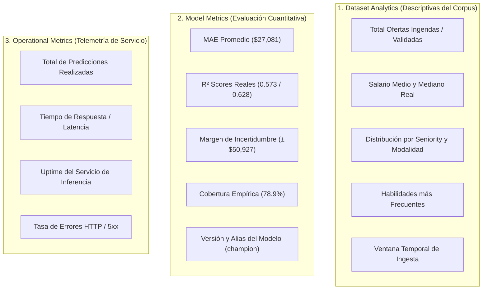

# Home Analytics Source Audit — SalaryPredict v1.0

**Fecha**: 2026-09-22  
**Proyecto**: SalaryPredict v1.0  
**Carácter de la auditoría**: Exclusivamente de lectura (Read-Only). No se modificó código fuente, configuración ni datos.

---

## 1. Resumen Ejecutivo

- **¿Las estadísticas son hardcoded?**  
  **Sí, el 100% de los valores mostrados en la página inicial son estáticos y hardcoded.** Todos los números, porcentajes, etiquetas de tendencia, conteos de tecnologías, muestras de ofertas y alturas de barras del gráfico se encuentran codificados como literales JSX directamente dentro de [`frontend/src/pages/Home/HomePage.tsx`](frontend/src/pages/Home/HomePage.tsx).
- **¿Existen estadísticas realmente derivadas del dataset en Home?**  
  **No.** Ningún valor visible en la página inicial proviene del dataset real ni de los reportes generados por el pipeline de Machine Learning. De hecho, los valores visibles contradicen los datos reales (por ejemplo, se muestra un R² de `94.2%` cuando el modelo oficial auditado obtiene `57.3%` y `62.8%`, y se muestran `1,450+` ofertas cuando el dataset cuenta con `260,158` filas validadas y `54,363` filas de modelado).
- **¿Existe actualmente un endpoint de analítica?**  
  **No.** El backend FastAPI expone exclusivamente endpoints operacionales (`/api/v1/health`, `/api/v1/predictions`, `/api/v1/predictions/model`, `/api/v1/predictions/status`). No existe ningún router, servicio, controlador ni esquema en el backend destinado a proveer métricas agregadas o analítica de datos.
- **¿Cuál es el principal gap?**  
  Existe una **desconexión arquitectónica total** entre los artefactos cuantitativos producidos por el pipeline ML (`ml/artifacts/reports/*.json`), el backend (que no lee dichos reportes ni los expone vía API) y el frontend (que no invoca ninguna API en la página inicial y renderiza únicamente mocks).

---

## 2. Inventario de Estadísticas Visibles

A continuación se detalla cada indicador renderizado en [`frontend/src/pages/Home/HomePage.tsx`](frontend/src/pages/Home/HomePage.tsx):

| Indicador UI | Valor actual | Componente / Ubicación | Fuente inmediata | Fuente final | Estado |
| :--- | :---: | :--- | :--- | :--- | :--- |
| **Badge de Versión** | `ML Model v1.0` | [`PageHeader`](frontend/src/components/ui/PageHeader/PageHeader.tsx) (Línea 21) | Literal prop en JSX | Ninguna | `HARDCODED` |
| **Ofertas Ingeridas** | `1,450+` | [`Card`](frontend/src/components/ui/Card/Card.tsx) (Líneas 26–37) | Literal JSX (`metricValue`) | Ninguna (Mock UI) | `HARDCODED` |
| **Tendencia Ofertas** | `+12.5% este mes` | [`Card`](frontend/src/components/ui/Card/Card.tsx) (Línea 34) | Literal JSX (`metricTrend`) | Ninguna (Mock UI) | `HARDCODED` |
| **Salario Medio Anual** | `$52,800` | [`Card`](frontend/src/components/ui/Card/Card.tsx) (Líneas 39–50) | Literal JSX (`metricValue`) | Ninguna (Mock UI) | `HARDCODED` |
| **Contexto Salario** | `USD mercado tech` | [`Card`](frontend/src/components/ui/Card/Card.tsx) (Línea 47) | Literal JSX (`metricTrend`) | Ninguna (Mock UI) | `HARDCODED` |
| **Roles Clasificados** | `18` | [`Card`](frontend/src/components/ui/Card/Card.tsx) (Líneas 52–63) | Literal JSX (`metricValue`) | Ninguna (Mock UI) | `HARDCODED` |
| **Contexto Roles** | `Data, Dev & DevOps` | [`Card`](frontend/src/components/ui/Card/Card.tsx) (Línea 60) | Literal JSX (`metricTrend`) | Ninguna (Mock UI) | `HARDCODED` |
| **R² Score Modelo** | `94.2%` | [`Card`](frontend/src/components/ui/Card/Card.tsx) (Líneas 65–76) | Literal JSX (`metricValue`) | Ninguna (Mock UI) | `HARDCODED` |
| **Tipo de Modelo** | `Gradient Boosting` | [`Card`](frontend/src/components/ui/Card/Card.tsx) (Línea 73) | Literal JSX (`metricTrend`) | Ninguna (Mock UI) | `HARDCODED` |
| **Barras Distribución Salarial** | 40%, 65%, 90%, 75%, 50%, 30% | `chartBarsVisual` (Líneas 87–94) | Estilos inline en JSX | Ninguna (CSS Mock) | `MOCK` |
| **Conteo Python** | `420` | `techTag` (Línea 132) | Literal JSX (`techCount`) | Ninguna (Mock UI) | `MOCK` |
| **Conteo React** | `380` | `techTag` (Línea 133) | Literal JSX (`techCount`) | Ninguna (Mock UI) | `MOCK` |
| **Conteo AWS** | `310` | `techTag` (Línea 134) | Literal JSX (`techCount`) | Ninguna (Mock UI) | `MOCK` |
| **Conteo Docker** | `290` | `techTag` (Línea 135) | Literal JSX (`techCount`) | Ninguna (Mock UI) | `MOCK` |
| **Conteo SQL** | `270` | `techTag` (Línea 136) | Literal JSX (`techCount`) | Ninguna (Mock UI) | `MOCK` |
| **Conteo TypeScript** | `240` | `techTag` (Línea 137) | Literal JSX (`techCount`) | Ninguna (Mock UI) | `MOCK` |
| **Conteo Kubernetes** | `180` | `techTag` (Línea 138) | Literal JSX (`techCount`) | Ninguna (Mock UI) | `MOCK` |
| **Conteo PyTorch / ML** | `150` | `techTag` (Línea 139) | Literal JSX (`techCount`) | Ninguna (Mock UI) | `MOCK` |
| **Muestra Registro 1** | `$75,000 - $95,000` | `tableRow` (Líneas 148–154) | Literal JSX (`roleSalary`) | Ninguna (Mock UI) | `MOCK` |
| **Muestra Registro 2** | `$45,000 - $60,000` | `tableRow` (Líneas 155–161) | Literal JSX (`roleSalary`) | Ninguna (Mock UI) | `MOCK` |
| **Muestra Registro 3** | `$55,000 - $70,000` | `tableRow` (Líneas 162–168) | Literal JSX (`roleSalary`) | Ninguna (Mock UI) | `MOCK` |

---

## 3. Trazabilidad por Indicador

A diferencia del flujo de predicción (que viaja desde `SalaryPredictionPage.tsx` ──> `salaryApi.ts` ──> `POST /api/v1/predictions` ──> `backend/app/clients/inference_client.py` ──> `POST :5001/invocations`), **la página inicial carece de cualquier cadena de llamadas**.

La cadena de cada elemento en Home es estrictamente local al componente:

```text
Navegador Web
└── frontend/src/pages/Home/HomePage.tsx
    ├── PageHeader (badge="ML Model v1.0")
    ├── Card 1 ──> <span>1,450+</span> / <span>+12.5% este mes</span>
    ├── Card 2 ──> <span>$52,800</span> / <span>USD mercado tech</span>
    ├── Card 3 ──> <span>18</span> / <span>Data, Dev & DevOps</span>
    ├── Card 4 ──> <span>94.2%</span> / <span>Gradient Boosting</span>
    ├── Card 5 ──> 6 barras con style={{ height: "XX%" }}
    ├── Card 6 ──> 8 etiquetas con conteos fijos (420, 380, ...)
    └── Card 7 ──> 3 filas con títulos y salarios fijos ($75k-$95k, ...)
```

- **Servicios importados**: Ninguno. [`frontend/src/services/salaryApi.ts`](frontend/src/services/salaryApi.ts) solo implementa `predictSalary()` y no es importado en `HomePage.tsx`.
- **Hooks de estado**: Ninguno (`useState`, `useEffect`, `useQuery` no se utilizan en `HomePage.tsx`).
- **Llamadas de red**: Cero solicitudes HTTP salientes durante el renderizado de la página inicial.

---

## 4. Valores Hardcoded y Mocks Detectados

A continuación se contrastan los valores estáticos mostrados en `HomePage.tsx` contra los valores reales producidos por el pipeline ML y registrados en los artefactos auditados:

| Concepto en Home | Valor Mostrado en Home | Valor Real en el Pipeline ML | Archivo Fuente de Verdad |
| :--- | :---: | :---: | :--- |
| **Volumen de ofertas** | `1,450+` | **`260,158`** (validadas)<br/>**`54,363`** (modelables)<br/>**`333,773`** (brutas en 5 cortes) | [`ml/artifacts/reports/validation.json`](ml/artifacts/reports/validation.json)<br/>[`ml/artifacts/reports/preprocess.json`](ml/artifacts/reports/preprocess.json)<br/>[`ml/artifacts/reports/data_manifest.json`](ml/artifacts/reports/data_manifest.json) |
| **R² Score del Modelo** | `94.2%` | **`57.3%`** ($R^2$ mín.)<br/>**`62.8%`** ($R^2$ máx.) | [`ml/artifacts/reports/metrics.json`](ml/artifacts/reports/metrics.json)<br/>[`README.md`](README.md) |
| **Salario Medio** | `$52,800` | **`$75,847`** (media mín.)<br/>**`$116,461`** (media máx.)<br/>**`$96,154`** (media punto medio) | [`ml/artifacts/reports/validation.json`](ml/artifacts/reports/validation.json) |
| **Salario Mediano** | N/A (no explícito) | **`$63,964`** (mediana mín.)<br/>**`$96,000`** (mediana máx.)<br/>**`$79,982`** (mediana punto medio) | [`ml/artifacts/reports/validation.json`](ml/artifacts/reports/validation.json) |
| **Roles Clasificados** | `18` | Miles de cargos libres target-encoded (en test ciego: 3,766 conocidos, 4,389 nuevos) | [`ml/artifacts/reports/audit_novelty.json`](ml/artifacts/reports/audit_novelty.json) |
| **Tecnologías Top** | Python (420), React (380), AWS (310), Docker (290) | Variables canónicas binarias: Machine Learning (imp: 1,127), SQL (imp: 1,116), Python (imp: 956), AWS (imp: 760.5). *React no es feature canónica del modelo.* | [`ml/artifacts/reports/feature_importance.json`](ml/artifacts/reports/feature_importance.json) |
| **Distribución salarial** | 6 barras CSS (40%..90%) | Distribución real acotada: piso `$10,935.57`, techo `$720,000.00` | [`ml/artifacts/reports/train_limits.json`](ml/artifacts/reports/train_limits.json) |

---

## 5. Relación con el Dataset

Al evaluar la semántica de las métricas visibles en Home frente a los datos reales:

1. **"Ofertas Ingeridas" (`1,450+`)**:
   - *Semántica ambigua*: No define si se refiere a vacantes crudas, deduplicadas o filtradas.
   - *Relación con el dataset*: En la realidad existen **333,773** registros crudos consolidados a partir de 5 snapshots Foorilla, **260,158** registros estructurados y validados tras deduplicación, y **54,363** registros con salario reportado (`target_source == 'reportado'`) aptos para modelado.
2. **"Salario Medio Anual" (`$52,800`)**:
   - *Semántica ambigua*: No aclara si es media de salario mínimo, máximo o punto medio, ni la población considerada.
   - *Relación con el dataset*: En la población modelable, la media del salario mínimo es **USD 75,847**, la media del salario máximo es **USD 116,461**, y el punto medio promedio es **USD 96,154**. El valor de $52,800 es un artefacto puramente ilustrativo de diseño inicial de UI.
3. **"Roles Clasificados" (`18`)**:
   - *Semántica ambigua*: Podría aludir a una taxonomía de cargos, pero el dataset no clasifica en 18 roles discretos. El pipeline procesa 24 variables canónicas en total (de las cuales 18 son numéricas en `preprocess.json`). El cargo (`title`) se modela mediante `TargetEncoder`.
4. **"R² Score Modelo" (`94.2%`)**:
   - *Semántica inconsistente*: Contradice abiertamente los resultados del modelo vigentes y auditados en `README.md` ($R^2$ mín. = 0.573, $R^2$ máx. = 0.628). Un $R^2$ de 94.2% en salarios tech del mundo real no es realista dado el ruido inherente a los datos de compensación.

---

## 6. Artifacts Existentes Reutilizables

El pipeline ML genera de forma determinista y versionada una serie de reportes en formato JSON en `ml/artifacts/reports/` que contienen información cuantitativa suficiente para alimentar la página inicial **sin necesidad de volver a procesar los archivos CSV**:

1. **[`data_manifest.json`](ml/artifacts/reports/data_manifest.json)**:
   - Contiene el total de snapshots procesados (`snapshot_count: 5`), el nombre de cada archivo, y la cantidad de filas crudas (`rows_raw`), sumando 333,773 registros.
2. **[`validation.json`](ml/artifacts/reports/validation.json)**:
   - Contiene el conteo total de filas validadas (`rows: 260,158`), desglose por tipo de objetivo (`estimado: 200,923`, `reportado: 54,363`, `híbrido: 4,872`), y estadísticas completas de salarios (`mean`, `median`, `min`, `max`, `std` para `y_min_usd` y `y_max_usd`).
3. **[`preprocess.json`](ml/artifacts/reports/preprocess.json)**:
   - Contiene el tamaño de las particiones temporales (`train: 38,054`, `validation: 8,154`, `test: 8,155`, total modelable: `54,363`), las fechas extremas de publicación (`2025-01-01` a `2026-09-01`), el número de features canónicas (`24`), y los límites operacionales (`train_limits`).
4. **[`metrics.json`](ml/artifacts/reports/metrics.json)**:
   - Contiene las métricas oficiales de prueba: MAE promedio (`$27,081`), $R^2$ mínimo (`0.573`), $R^2$ máximo (`0.628`), margen de incertidumbre (`$50,927`), y cobertura empírica (`78.9%`).
5. **[`audit_segments.json`](ml/artifacts/reports/audit_segments.json)**:
   - Contiene la distribución y medianas por país (Estados Unidos, Canadá, India, etc.), por nivel de experiencia (`SE`, `MI`, `EN`, `EX`), por modalidad de trabajo (`presencial`, `remoto`, `híbrido`), y por grupos de años de experiencia.
6. **[`feature_importance.json`](ml/artifacts/reports/feature_importance.json)**:
   - Contiene el ranking de importancia de variables canónicas y habilidades tecnológicas (`skill_machine_learning`, `skill_sql`, `skill_python`, `skill_aws`, `skill_spark`, etc.).

---

## 7. Clasificación de Métricas

Para una futura implementación analítica, las métricas deben separarse rigurosamente en tres dominios conceptuales independientes:



- **Dataset Analytics**: Propiedad del ciclo de datos (`ml/`). Se derivan de `data_manifest.json`, `validation.json`, `preprocess.json` y `audit_segments.json`.
- **Model Metrics**: Propiedad del ciclo de evaluación y registro (`ml/` y `model_provider/`). Se derivan de `metrics.json` y del Model Registry.
- **Operational Metrics**: Propiedad del runtime de producción (`backend/` y `model_provider/inference`). Requieren telemetría activa, contador de invocaciones o monitoreo Prometheus/OpenTelemetry (no derivables de datasets de entrenamiento).

---

## 8. Gap Arquitectónico Actual

Para que la página inicial muestre información cuantitativa real se identifican cuatro vacíos estructurales en el monorepo:

1. **Frontend**:
   - `HomePage.tsx` no dispone de estado reactivo (`useState`), ciclo de vida (`useEffect`) ni gestión de estados de carga/error (`loading`, `error`, `data`).
   - `frontend/src/services/salaryApi.ts` carece de métodos para consultar endpoints de analítica.
2. **Backend**:
   - No existe un router `/api/v1/analytics` o `/api/v1/stats`.
   - No existen schemas Pydantic para representar el resumen analítico del dataset o del modelo.
   - No existe un servicio lector de artefactos de analítica.
3. **Pipeline ML**:
   - Aunque los datos están dispersos en múltiples reportes (`validation.json`, `preprocess.json`, `metrics.json`, etc.), no existe un artefacto consolidado específico orientado a servir la UI (`summary_stats.json` o `dashboard_metrics.json`).
4. **Infraestructura y Despliegue**:
   - En `docker-compose.yml`, el contenedor `mlops-backend` no tiene montado el volumen ni directorio `ml/artifacts/reports/`. Si el backend deseara leer estos reportes en ejecución bajo Docker, actualmente no tendría acceso a ellos en el sistema de archivos del contenedor.

---

## 9. Opciones de Evolución

| Enfoque | Descripción | Ventajas | Desventajas | Viabilidad en SalaryPredict |
| :--- | :--- | :--- | :--- | :---: |
| **A. Hardcoded Actualizado** | Actualizar los textos de `HomePage.tsx` con los números reales de `README.md` (ej. 54,363 ofertas, R² 0.60, MAE $27k). | Inmediato, sin cambios en backend ni Docker. | Se desactualiza manualmente con cada reentrenamiento o nuevo snapshot. | Solo paliativo a corto plazo. |
| **B. Cálculo Backend sobre CSV** | Crear un endpoint en backend que lea `jobs_*.csv` con Pandas en cada petición o al arrancar. | Datos 100% frescos del dataset. | Pésimo rendimiento (leer cientos de MB de CSVs en memoria), alto consumo de RAM, acopla el backend al almacenamiento crudo de datos. | **No recomendable**. |
| **C. Artifact Liviano generado por Pipeline (Recomendado)** | El pipeline ML genera un JSON consolidado (`dashboard_summary.json`, <50 KB); backend lo lee y expone vía `GET /api/v1/analytics/summary`. | Completamente reproducible (DVC), desacoplado, ultraligero, tiempo de respuesta < 5 ms, respeta la inmutabilidad de MLOps. | Requiere montar el directorio de reportes o empaquetar el artifact con el despliegue. | **Altamente recomendado**. |
| **D. Consulta Directa a MLflow** | Backend consulta la API de MLflow Tracking para obtener métricas del último `champion`. | Métricas del modelo siempre sincronizadas con el alias activo. | Solo cubre métricas del modelo (MAE, R²), no cubre estadísticas descriptivas del dataset ni frecuencias de tecnologías. | Complementario para métricas de modelo. |
| **E. Telemetría Operacional** | Implementar contadores en memoria o SQLite/Redis para registrar predicciones servidas. | Muestra actividad real del sistema en producción. | Requiere persistencia adicional y no reemplaza las estadísticas del dataset. | Fase posterior. |

---

## 10. Recomendación para una Siguiente Fase

Para transicionar de la página estática actual a un tablero con analítica real y reproducible:

1. **Fase ML (Generación de Artefacto)**:
   - Configurar una tarea liviana en el pipeline (o extender `evaluate` / `collect`) para consolidar un archivo JSON ligero: `ml/artifacts/reports/dashboard_summary.json`.
   - Este archivo debe incluir:
     - Volumen total de vacantes validadas y modeladas.
     - Salario mediano y medio observado.
     - R² real y MAE oficial del modelo.
     - Distribución por seniority (`SE`, `MI`, `EN`, `EX`) y modalidad (`remoto`, `presencial`, `híbrido`).
     - Frecuencia real de las tecnologías canónicas (`skill_*`).
2. **Fase Backend (Exposición de Contrato)**:
   - Crear el endpoint `GET /api/v1/analytics/summary` en `backend/app/api/routes/analytics.py`.
   - Implementar un servicio que lea `dashboard_summary.json` (con fallback seguro a valores por defecto si el archivo no estuviera presente).
   - Montar el directorio de reportes como volumen de solo lectura en `docker-compose.yml` para el backend.
3. **Fase Frontend (Consumo React)**:
   - Agregar la función `getDashboardSummary()` en `frontend/src/services/salaryApi.ts`.
   - Actualizar `HomePage.tsx` con un hook que consulte dicho endpoint al montar el componente, mostrando estados de carga y renderizando los indicadores y distribución real del dataset.

---

## 11. Archivos Inspeccionados

Durante la presente auditoría se analizaron exhaustivamente los siguientes archivos del repositorio:

- **Frontend**:
  - [`frontend/src/pages/Home/HomePage.tsx`](frontend/src/pages/Home/HomePage.tsx)
  - [`frontend/src/pages/Home/HomePage.module.css`](frontend/src/pages/Home/HomePage.module.css)
  - [`frontend/src/services/salaryApi.ts`](frontend/src/services/salaryApi.ts)
  - [`frontend/src/pages/ExploreData/ExploreDataPage.tsx`](frontend/src/pages/ExploreData/ExploreDataPage.tsx)
  - [`frontend/src/components/ui/PageHeader/PageHeader.tsx`](frontend/src/components/ui/PageHeader/PageHeader.tsx)
  - [`frontend/src/components/ui/Card/Card.tsx`](frontend/src/components/ui/Card/Card.tsx)
- **Backend**:
  - [`backend/app/main.py`](backend/app/main.py)
  - [`backend/app/api/router.py`](backend/app/api/router.py)
  - [`backend/app/api/routes/predictions.py`](backend/app/api/routes/predictions.py)
  - [`backend/app/api/routes/health.py`](backend/app/api/routes/health.py)
  - [`backend/app/clients/inference_client.py`](backend/app/clients/inference_client.py)
  - [`backend/app/core/config.py`](backend/app/core/config.py)
- **Pipeline ML y Reportes**:
  - [`ml/artifacts/reports/data_manifest.json`](ml/artifacts/reports/data_manifest.json)
  - [`ml/artifacts/reports/validation.json`](ml/artifacts/reports/validation.json)
  - [`ml/artifacts/reports/preprocess.json`](ml/artifacts/reports/preprocess.json)
  - [`ml/artifacts/reports/qualification.json`](ml/artifacts/reports/qualification.json)
  - [`ml/artifacts/reports/training.json`](ml/artifacts/reports/training.json)
  - [`ml/artifacts/reports/metrics.json`](ml/artifacts/reports/metrics.json)
  - [`ml/artifacts/reports/audit_segments.json`](ml/artifacts/reports/audit_segments.json)
  - [`ml/artifacts/reports/audit_novelty.json`](ml/artifacts/reports/audit_novelty.json)
  - [`ml/artifacts/reports/feature_importance.json`](ml/artifacts/reports/feature_importance.json)
  - [`ml/artifacts/reports/candidate.json`](ml/artifacts/reports/candidate.json)
  - [`ml/artifacts/reports/train_limits.json`](ml/artifacts/reports/train_limits.json)
- **Configuración y Documentación**:
  - [`README.md`](README.md)
  - [`DEPLOYMENT.md`](DEPLOYMENT.md)
  - [`docker-compose.yml`](docker-compose.yml)

---

HOME_ANALYTICS_SOURCE_AUDIT_STATUS=COMPLETE
