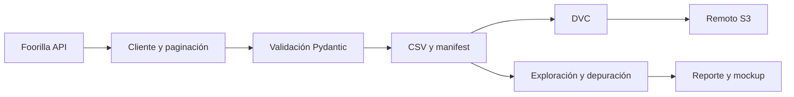

# PREDICCIÓN DE RANGO DE SALARIOS POSICIONES DATOS, IA Y MACHINE LEARNING — Microproyecto PDS 2026-14

Proyecto académico para analizar vacantes de datos, inteligencia artificial y *machine learning* y, en fases posteriores, estimar rangos salariales anuales en USD según las características de una vacante.

> **Estado:** Entrega 1 — definición del problema, ingesta y versionamiento de datos, exploración inicial, maqueta del prototipo y esqueletos base de frontend y backend. El modelo predictivo, los endpoints de predicción y el tablero conectado a datos reales todavía no están implementados.

## Problema y pregunta de negocio

La adopción de inteligencia artificial está transformando la demanda de talento, las habilidades requeridas y las expectativas salariales. Profesionales, reclutadores y empleadores necesitan referencias comparables para interpretar una oferta dentro de un cargo y mercado determinados.

La pregunta que orienta el proyecto es:

> ¿Qué rango salarial anual en USD puede esperar un profesional de datos, inteligencia artificial o *machine learning*, dadas las características de la vacante —cargo, experiencia, país, modalidad, tecnologías y tipo de publicador—, y cómo varía ese rango entre mercados?

El resultado esperado en las siguientes fases estará compuesto por dos objetivos:

- `Y1 = salary_min_usd`: límite salarial mínimo ofrecido.
- `Y2 = salary_max_usd`: límite salarial máximo ofrecido.

Los datos representan remuneraciones ofrecidas en publicaciones de empleo, no salarios efectivamente recibidos. El proyecto tiene fines académicos y no sustituye una valoración laboral individual.

## Alcance de la Entrega 1

Esta entrega cubre:

- Definición del problema, usuario y pregunta de negocio.
- Ingesta de vacantes desde la API de Foorilla.
- Validación y aplanamiento del esquema de la API.
- Generación de archivos CSV fechados y manifiestos de extracción.
- Versionamiento de los datos mediante DVC y un remoto S3.
- Exploración, limpieza y análisis descriptivo de los datos.
- Maqueta de seis vistas para el futuro tablero.
- Esqueletos técnicos del frontend en React/Vite y del backend en FastAPI.
- Pruebas unitarias del cliente y del esquema de ingesta.

Aunque existen sus estructuras iniciales, aún no están implementados funcionalmente:

- Entrenamiento y selección del modelo.
- Seguimiento de experimentos y versionamiento de modelos.
- Endpoints de predicción en el backend.
- Integración del frontend con datos y predicciones reales.
- Despliegue, integración continua y monitoreo.

## Datos

### Fuente

Las vacantes proceden de [Foorilla Hiring](https://foorilla.com/hiring/) mediante `GET /api/v1/hiring/job/`. La extracción utiliza `topic=101`, correspondiente a **Data, AI, and Machine Learning**.

### Cortes disponibles

| Corte | Tipo | Registros |
|---|---|---:|
| 2026-08-16 | Base | 326.311 |
| 2026-08-17 | Incremental desde 2026-08-15 | 180 |
| **Total integrado** | Antes de consolidación | **326.491** |

La cobertura temporal de las publicaciones va del 1 de enero de 2025 al 17 de agosto de 2026. Los dos cortes contienen 326.443 identificadores únicos antes de consolidar republicaciones.

El esquema contiene 28 variables sobre identificación, empresa, cargo, ubicación, modalidad, experiencia, fechas, idioma, remuneración, temas, etiquetas, regiones, países y URL de postulación. Las tecnologías se identificarán a partir de `tags` mediante un vocabulario que debe ser depurado y validado.

La documentación detallada de la API, el esquema y las opciones de extracción se encuentra en [INGESTA_DATOS.md](INGESTA_DATOS.md).

### Resultados exploratorios de la entrega

La consolidación descrita en el reporte de la Entrega 1 produce:

- 277.668 vacantes después de consolidar identificadores y republicaciones.
- 254.577 vacantes en la muestra salarial final.
- 53.290 rangos completamente reportados por las vacantes.
- 196.490 rangos estimados por Foorilla.
- 4.797 rangos híbridos.

Los salarios estimados, reportados e híbridos se analizarán por separado, pues no tienen la misma procedencia ni confiabilidad. Las diferencias entre países, experiencia o modalidad son asociaciones descriptivas y no deben interpretarse como efectos causales.

> **Pendiente de la Entrega 1:** versionar en el repositorio el notebook o pipeline completo que reproduce la integración, depuración, cifras y figuras presentadas en el reporte. El notebook actual es únicamente un punto de partida para cargar e inspeccionar el último corte.

## Flujo de datos de esta entrega



## Estructura del repositorio

```text
Microproyecto/
├── .dvc/                    # Configuración de DVC y remoto S3
├── backend/                 # Base FastAPI, endpoint de salud y pruebas
├── data/raw/foorilla.dvc    # Puntero DVC a los archivos de datos
├── frontend/                # Base React/Vite con las vistas del mockup
├── ml/                      # Espacio reservado para el modelo
├── mlflow/                  # Espacio reservado para tracking de experimentos
├── notebooks/
│   └── 01_eda_ingested_data.ipynb
├── src/ingestion/
│   ├── client.py            # Cliente, autenticación, paginación y reintentos
│   ├── config.py            # Configuración mediante variables de entorno
│   ├── fetch.py             # Extracción, validación y escritura de CSV/manifest
│   └── schema.py            # Modelos Pydantic del esquema de la API
├── tests/unit/              # Pruebas del cliente y del esquema
├── ATTRIBUTION.md           # Condiciones de atribución de los datos
├── INGESTA_DATOS.md         # Documentación detallada de la ingesta
├── requirements.txt         # Dependencias directas
└── requirements.lock.txt    # Entorno reproducible con versiones fijadas
```

El frontend y el backend son bases de desarrollo incorporadas al repositorio; su presencia no implica que el modelo o el flujo de predicción estén terminados. Cada componente tiene instrucciones adicionales en [backend/README.md](backend/README.md) y [frontend/README.md](frontend/README.md). Las carpetas `ml/` y `mlflow/` son marcadores para fases posteriores.

## Preparación del entorno

El desarrollo local de esta entrega se realizó con Python 3.12.

```powershell
git clone https://github.com/PDS-Microproyecto-Grupo-13/Microproyecto.git
cd Microproyecto

python -m venv .venv
.venv\Scripts\Activate.ps1

python -m pip install --upgrade pip
pip install -r requirements.lock.txt
```

Para realizar una extracción nueva se necesita una clave de la API de Foorilla. Puede definirse en un archivo local `.env`, que está excluido de Git:

```dotenv
FOORILLA_API_KEY=REEMPLAZAR_CON_LA_CLAVE_PERSONAL
FOORILLA_BASE_URL=https://foorilla.com/api/v1
FOORILLA_RATE_LIMIT_RPS=5
```

No se deben guardar claves de Foorilla o AWS en el repositorio.

## Recuperación de datos con DVC

Los archivos grandes no se almacenan directamente en Git. El archivo `data/raw/foorilla.dvc` identifica la versión y DVC recupera el contenido desde el remoto configurado:

```text
s3://amzn-s3-mlops-foorilla
```

Con credenciales AWS autorizadas:

```powershell
dvc remote list
dvc pull
```

Después de `dvc pull`, los CSV y manifiestos deben quedar disponibles bajo `data/raw/foorilla/`.

## Ejecución de la ingesta

Prueba limitada a tres páginas:

```powershell
python -m src.ingestion.fetch --endpoint jobs --topic 101 --max-pages 3
```

Extracción incremental:

```powershell
python -m src.ingestion.fetch `
  --endpoint jobs `
  --topic 101 `
  --published-after 2026-08-15
```

Una extracción completa sin filtros puede contener millones de registros. Debe utilizarse el filtro de tema y respetarse el límite documentado de cinco solicitudes por segundo.

## Pruebas

Las pruebas unitarias simulan las respuestas HTTP; no requieren una clave real ni realizan llamadas a Foorilla.

```powershell
pytest tests/unit -v
```

Actualmente se verifican, entre otros comportamientos:

- Autenticación mediante el encabezado `Api-Key`.
- Paginación y límite de páginas.
- Aplicación de filtros de tema y fecha.
- Manejo de respuestas vacías.
- Validación y aplanamiento de empresa, temas y etiquetas.

## Maqueta y entregables

La maqueta propone seis vistas: inicio, configuración de la vacante, resultado salarial, exploración de datos, comparaciones y metodología. Sus cifras son ilustrativas y deben reemplazarse por resultados reproducibles durante la implementación.

Los documentos y mockups de la entrega se gestionan en la [carpeta compartida del proyecto en Google Drive](https://drive.google.com/drive/folders/1OJGFU8tAQoJhi_E4XjqN_G786SNur4RN?usp=drive_link).

## Limitaciones conocidas

- La mayoría de los rangos disponibles fueron estimados por Foorilla.
- `work_mode` tiene baja cobertura y sus códigos aún requieren validación formal.
- `tags` contiene tecnologías, pero también cargos, responsabilidades, formación y beneficios.
- Agosto de 2026 es un mes incompleto por la fecha de corte.
- La cobertura es desigual entre países y perfiles.
- Las ubicaciones pueden contener varios países o nombres ambiguos.
- Los resultados representan ofertas salariales publicadas.

## Equipo

- Alejandra Barbosa Contreras
- Francisco Javier Lozano Otálora
- Ramiro Alfonso Bautista Parra
- Zenon Jorge Alanoca Aguilar

Las contribuciones individuales se evidencian mediante el historial de commits y el reporte de trabajo en equipo de la entrega.

## Fuente, licencia y atribución

Los datos de vacantes y salarios proceden de [Foorilla](https://foorilla.com/api/) y están disponibles bajo licencia [CC BY-SA 4.0](https://creativecommons.org/licenses/by-sa/4.0/). Los datos fueron limpiados y transformados para fines académicos; los resultados no implican respaldo de Foorilla.

Las condiciones completas de atribución y uso se encuentran en [ATTRIBUTION.md](ATTRIBUTION.md).
