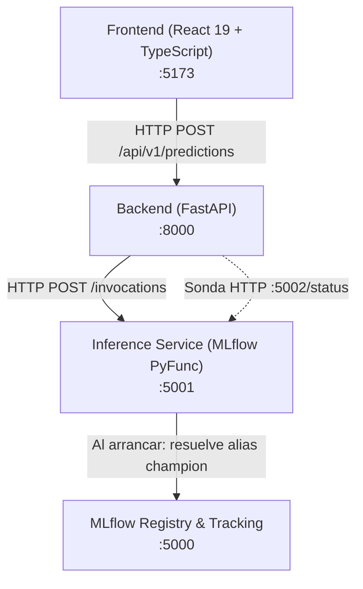

# SalaryPredict — Estimación de Rangos Salariales en Datos, IA y ML

SalaryPredict es una plataforma MLOps orientada a estimar el rango salarial anual en USD ofrecido en publicaciones de empleo para posiciones de **Data, Inteligencia Artificial y Machine Learning**.

A partir de las características del perfil laboral (título, experiencia, país, modalidad, empresa y habilidades técnicas), el sistema predice tres valores de referencia:
- **Salario mínimo ofrecido** (`minimum_usd`)
- **Salario máximo ofrecido** (`maximum_usd`)
- **Punto medio** (`midpoint_usd`)

> [!NOTE]
> Los datos modelados corresponden a remuneraciones ofertadas en publicaciones laborales, no a salarios efectivamente percibidos de forma individual.

---

## Estado

**SalaryPredict v1.0** — Entregable final con integración End-to-End (E2E) funcional entre interfaz web, backend REST, servicio de inferencia y registro central de modelos.

---

## Arquitectura

### 1. Flujo de Servicio E2E (Runtime Serving)



### 2. Flujo MLOps y Ciclo de Vida del Modelo


---

## Componentes del Monorepo

- **`frontend/`**: Tablero web interactivo en React 19 y Vite para capturar perfiles, visualizar estimaciones salariales y explorar diagnósticos.
- **`backend/`**: Microservicio FastAPI que valida esquemas de entrada (Pydantic), traduce el contrato a MLflow, comprueba invariantes numéricas y expone la API REST.
- **`ml/`**: Pipeline reproducible DVC para ingesta multi-snapshot, validación, preprocesamiento temporal, calificación, calibración de incertidumbre, entrenamiento dual LightGBM y evaluación sobre test ciego.
- **`model_provider/`**: Infraestructura de tracking MLflow sobre SQLite, servidor de serving inmutable con reporte de estado en runtime (`start.py`) y utilidades operacionales CLI de promoción y verificación de drift.

---

## Stack Tecnológico

| Capa | Tecnologías |
| :--- | :--- |
| **Frontend** | React 19, TypeScript, Vite, Tailwind CSS, Lucide Icons |
| **Backend API** | FastAPI, Pydantic v2, HTTPX, Uvicorn |
| **Modelado ML** | LightGBM, Scikit-Learn, Pandas, NumPy, Joblib |
| **Gestión de Datos** | DVC (Data Version Control) sobre Google Drive / S3 |
| **Tracking & Registry** | MLflow 3 (Tracking Server, Model Registry, PyFunc flavor) |
| **Orquestación & Despliegue** | Docker, Docker Compose v2, Nginx |

---

## Pipeline MLOps

El flujo reproducible de modelado en `ml/` se estructura en dos fases complementarias:

1. **Gobernado por DVC (`dvc repro`)**:
   `collect -> validate -> preprocess -> qualify -> train -> evaluate`
2. **Operaciones operacionales externas**:
   `track -> register-candidate -> promote -> redeploy`

> **Principio de gobierno**: `train != track != register != promote != deploy`. El entrenamiento produce artefactos locales; el tracking registra el experimento; el registro crea una versión formal candidata; la promoción reasigna el alias de producción; y el despliegue actualiza el serving inmutable en memoria.

---

## Resultados del Modelo Vigente

El modelo operacional aprobado (`salary-predictor@champion`, LightGBM con 24 variables canónicas) evaluado sobre el conjunto de prueba ciego (*test split* de 8,155 observaciones) presenta las siguientes métricas oficiales:

| Métrica | Valor Obtenido |
| :--- | :--- |
| **MAE Promedio Conjunto** | **~USD 27,081** (USD 22,487 para mín. / USD 31,675 para máx.) |
| **Coeficiente $R^2$ Salario Mínimo ($Y_1$)** | **0.573** |
| **Coeficiente $R^2$ Salario Máximo ($Y_2$)** | **0.628** |
| **Margen Operacional de Incertidumbre** | **$\pm$USD 50,927** |
| **Cobertura Empírica en Prueba** | **78.9%** (frente al 80.0% nominal calibrado) |

*Notas de auditoría y paridad*:
- **Notebook de referencia vs. pipeline operacional**: Clasificación cuantitativa **`VERY_SIMILAR`** (con diferencias aproximadamente inferiores al 0.60% en MAE y deltas menores a 0.005 en $R^2$).
- **Paridad de serving**: Discrepancia numérica exacta de **0.000000 USD** (`max delta = 0 USD`) evaluada entre el bundle local (`model.joblib`), el wrapper PyFunc y el microservicio HTTP de inferencia en Docker.

---

## Quick Start (Despliegue Rápido)

Si ya existe un estado de MLflow o volúmenes locales que contengan el modelo registrado `salary-predictor` con el alias `champion`:

```bash
git clone git@github.com:PDS-Microproyecto-Grupo-13/Microproyecto.git
cd Microproyecto
docker compose up -d --build
```

> [!WARNING]
> Este inicio rápido asume que el Model Registry ya contiene un modelo `salary-predictor` con alias `champion`. Si se inicia desde una **máquina completamente limpia sin estado previo de MLflow**, consulte obligatoriamente la [Modalidad B en DEPLOYMENT.md](DEPLOYMENT.md) para ejecutar el procedimiento de bootstrap en el orden requerido.

---

## Endpoints Principales

| Servicio | URL / Endpoint | Descripción |
| :--- | :--- | :--- |
| **Frontend Web** | `http://localhost:5173` | Tablero de usuario interactivo |
| **Backend API & Swagger** | `http://localhost:8000/docs` | Documentación interactiva OpenAPI |
| **MLflow UI** | `http://localhost:5000` | Experimentos, corridas y Model Registry |
| **Runtime Serving Status** | `http://localhost:5002/status` | Estado y versión del modelo en ejecución |

---

## Pruebas Automatizadas

Comandos vigentes para ejecutar la suite de pruebas de calidad:

```bash
# Backend (FastAPI, clientes e invariantes)
pytest backend/tests

# Model Provider (Serving, start.py, promoción y alineación)
pytest model_provider/tests

# ML Pipeline (Ingesta, preprocesamiento, contratos y evaluación)
pytest ml/tests/unit ml/tests/contract

# Frontend (Linter de código y verificación de tipos/build)
cd frontend && npm run lint && npm run build
```

---

## Documentación Detallada

- [DEPLOYMENT.md](DEPLOYMENT.md) — Manual reproducible de despliegue, bootstrap desde cero, verificación y rollback.
- [INGESTA_DATOS.md](INGESTA_DATOS.md) — Especificación técnica de la ingesta de vacantes desde la API de Foorilla.
- [ATTRIBUTION.md](ATTRIBUTION.md) — Condiciones de licenciamiento y atribución de los datos bajo licencia CC BY-SA 4.0.

---

## Equipo

- Alejandra Barbosa Contreras
- Francisco Javier Lozano Otálora
- Ramiro Alfonso Bautista Parra
- Zenon Jorge Alanoca Aguilar

---

## Licencia y Atribución

Los datos salariales y de vacantes proceden de [Foorilla](https://foorilla.com/api/) bajo licencia [CC BY-SA 4.0](https://creativecommons.org/licenses/by-sa/4.0/). Los datos fueron depurados y utilizados para entrenar modelos predictivos académicos; las salidas no implican respaldo formal por parte de Foorilla.
